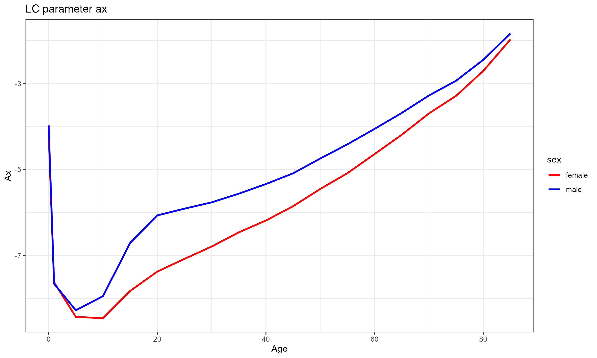
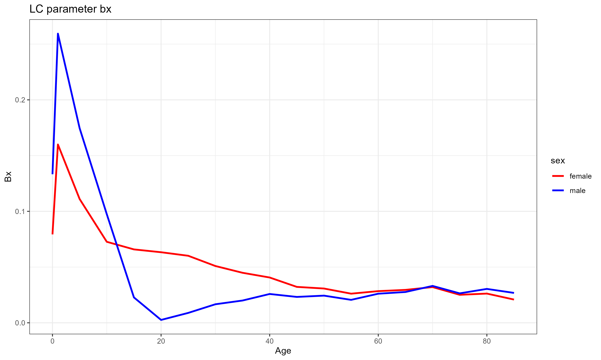
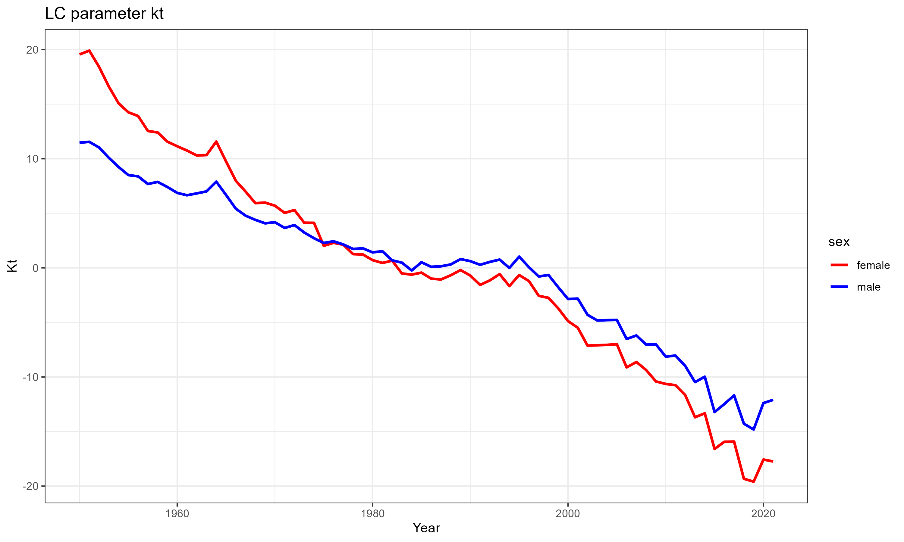
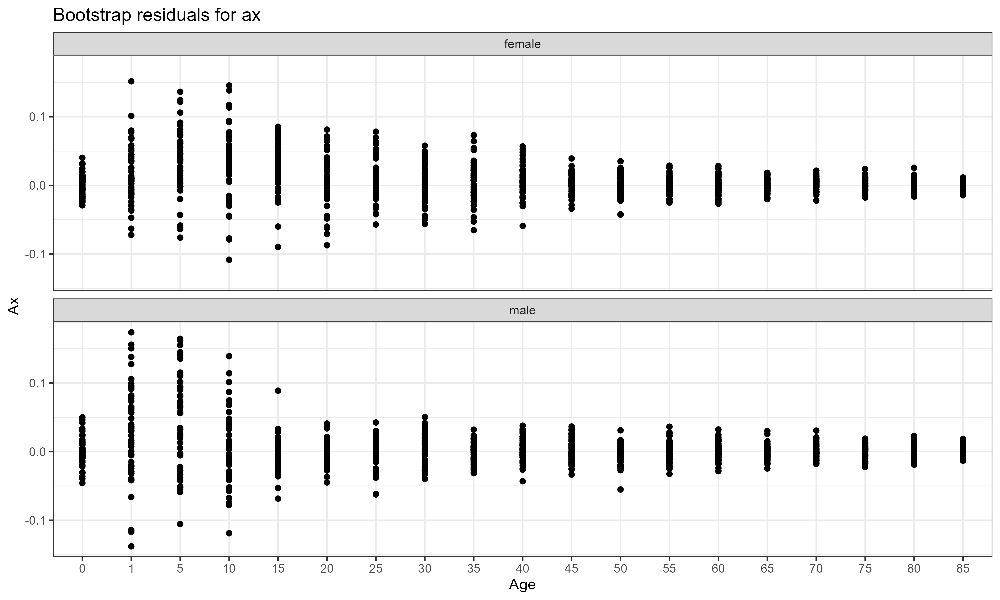
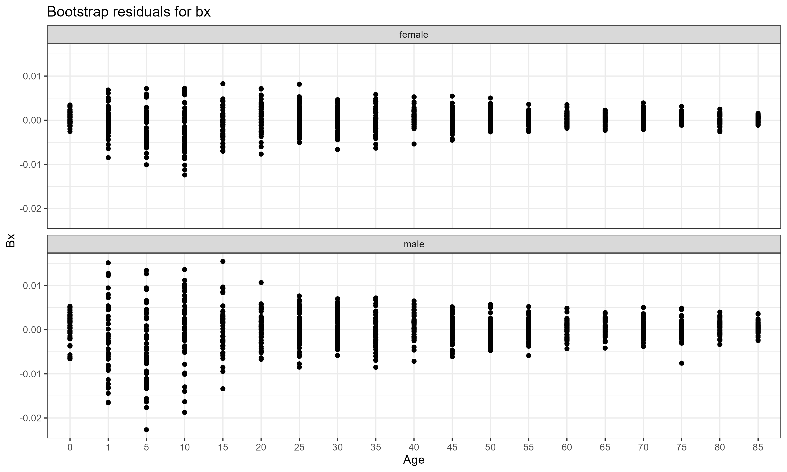
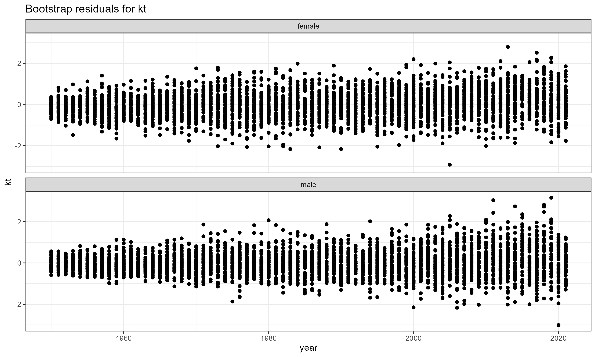
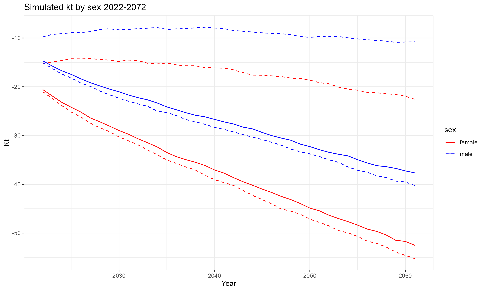

```{r}
#| include: false
library(tidyverse)
library(glue)

bootstrap_residuals_ax <- rio::import('../graphs/01_boot_residuals_ax.csv') 
bootstrap_residuals_bx <- rio::import('../graphs/01_boot_residuals_bx.csv')
bootstrap_residuals_kt <- rio::import('../graphs/01_boot_residuals_kt.csv')

simulated_kt <- rio::import('../graphs/01_simulated_kt.csv')
deathrates <- rio::import('../graphs/01_deathrates.csv')
lifetables <- rio::import('../graphs/01_lifetables.csv')
```

# Lee Carter

The Lee-carter model was introduced in 1992 by Ronald Lee and Lawrence Carter in their paper "Modeling and Forecasting U.S. Mortality"[@lee1992modeling]. It revolutionized mortality forecasting by providing a data-driven approach in lieu of the expert-led methods that were previously dominant. Prior to its development, official forecasts often underestimated the gains in human life expectancy[@olshansky1988forecasting], creating a pressing need for more accurate projections to assess the solvency of pension systems and social security programs.

The model's core innovation was its ability to reduce the matrix of log age specific death rates into a single time varying mortality index $K_t$ an age specific sensitivity parameter $b_x$. and a baseline mortality rate $a_x$. To achieve this, Lee and Carter applied Singular Value Decomposition (SVD) to extract the characteristic pattern of mortality improvement over time. Unfortunately, the solution to the SVD is not unique, so they imposed two constraints: the sum of $b_x$ across ages must equal 1, and the sum of $K_t$ across time must equal 0. This allowed them to identify a unique solution that captured the dominant trend in mortality improvement. Then by only taking the first singular value and its corresponding vectors in $a_x$ and $b_x$, they reduce the complexity of the data while retaining the most important information. This serves as compression of the data reducing the number of parameters needed to model mortality trends but keeping the essential features of the data. Following this, the time-varying mortality index $K_t$ is modeled as a random walk with drift, allowing for the creation of objective prediction intervals that provided a quantifiable measure of uncertainty. This was a significant departure from previous "best-guess" forecasts, which lacked any formal way to assess the range of possible outcomes.


The simplicity and robustness of the Lee-Carter model allowed it to outperform contemporary models[@booth2006demographic], closely tracking actual mortality data while older models significantly under-predicted life expectancy gains. Its ability to capture the linear trend of log-mortality decline across the 20th century made it particularly effective for long-term forecasting. Unlike earlier parametric models that focused on the biological shape of the mortality curve at a single point in time, the Lee-Carter model prioritized the dynamic movement of that curve over decades.

Thanks to the nature of the Lee-Carter model extensions and variations have been developed to address its limitations and improve its accuracy. For example, the LC-ER (Extended Rotation) method was developed to account for "rotation" in mortality decline, which addresses implausible age-pattern artifacts in vanilla LC projections. Additionally, the stmomo R package[@villegas2018package], whose implementation we will be using later, provides a flexible framework for mortality forecasting using the Lee-Carter model as well as several other models, allowing users to fit the model to various data types and generate forecasts while assessing uncertainty.

The model and its extensions have been used in various applications, including forecasting breast cancer mortality in China and Pakistan[@Mubarik2023l], where it outperformed simpler models for the screen-age/late-onset population (ages 50–84), revealing rising mortality in Pakistan versus declining rates in China, which was used to inform targeted healthcare interventions. The UN employs the LC model to forecast global mortality trends, especially for long-term projections up to 2100[@wpp2022methodology]. For high-life-expectancy countries like Japan, the model was extended to account for “rotation” in mortality decline (slowing improvements at young ages and accelerating declines at older ages). This adjustment, termed the LC-ER (Extended Rotation) method, addressed implausible age-pattern artifacts in vanilla LC projections.

Now, when talking about the implementation we will be using, Stochastic Mortality Modeling (stMoMo) is an R package that provides a comprehensive framework for fitting and forecasting mortality models, including the Lee-Carter model. The stMoMo package allows users to easily fit the Lee-Carter model to their mortality data, generate forecasts, and assess uncertainty through confidence intervals. It also includes various extensions of the Lee-Carter model, such as the LC-ER method, which can be used to improve the accuracy of forecasts for high-life-expectancy countries. The package is designed to be user-friendly and flexible, making it accessible for researchers and practitioners in the field of mortality forecasting. For our use case, we will be using the base Lee-Carter model and using its initial fit to bootstrap its parameters to then simulate numerous forecasts to create a distribution of possible outcomes. For this we need to set several parameter. First would be the link function, which determines the random component associated with the mortality model. The default link function is the log link, this assumes that the deaths follow a Poisson distribution, which is appropriate for count data like mortality. Secondly, we need to set the restraints for the model to ensure identifiability. For this we will set it as "sum". This ensures that $\Sigma_t k_t=0$. With these two we can now create the seed fit for the bootstrapping process. The bootstrap itself requires its own set of parameters, these being the number of bootstrap samples, the approach to be applied and the type of death to resample. After several cycles, we determined that 100 samples generated properly distributed residuals, but for robustness, we choose 500 to provide a more robust fit and still iterate at an acceptable pace. Following this we proceed to the simulations. The needed parameters for this are the number of simulations which we will set as the same as the number of bootstraps, the years to project set at 40. The jump choice, whether to use the fitted end or the actual end, we will choose the actual end in the data. Lastly for the simulation is the method of the projection of kt. Our alternatives are multivariate random walk with drift and an N independent arima models.
The result of of this is a series of 500 by 500 death rates for each of the 40 years to be projected for every age group. We can then select the projections that correspond to the median and the 97.5% and 2.5% quantiles to generate out confidence intervals for the death rates per age grou, the first of our final projects. Following this we can turn these into life tables to generate our final product, the life expectancy at birth projections with confidence intervals.

\newpage

# Methodology

## The input matrix

Starting off with the input matrix, this is the matrix of log age specific death rates that we will be using to fit the model. The matrix is organized by age and year, with the log of the death rates for each age group and year. Our original input data for this matrix comes in the form of death counts and population exposures, which we then convert into death rates by dividing the death counts by the population exposures. Finally, we take the log of these death rates to create the input matrix for the Lee-Carter model. The data comes from multiple sources. The population estimates come from the US Census Bureau decennial censuses divided into age groups and sex and interpolated for the intercensal years using a linear spline. The mortality data is a collage of multiple sources (state health department, WHO database and the Department of Health, Education, and Welfare (HEW) now Department of Health and Human Services (HHS)). The data is organized into 5-year age groups and single year of age for the first year of life, and then 85+ for the last group.

We then pass this matrix to the stMoMo package to fit the Lee-Carter model and extract the parameters.

\newpage

# The initial fit
## Fitted ax

Once the initial model fitting is completed, we have all our initial products. The first of these, ax parameter, serves as the baseline mortality for the population. It represents the average log mortality rate for each age group across the entire time period. The ax parameter captures the general shape of the mortality curve, which typically shows high mortality rates at very young ages, a decline in mortality during childhood and early adulthood, and then an increase in mortality as people age. Ours graphs as follows.

{fig-align="center"}

Here, we can see the drastic fall of the baseline log mortality after the first year of life. This is followed by the steady increase as one ages and the telltale male mortality hump starting at the teen years followed by a slow closing of the gap between the sexes as they age.
\newpage

## Fitted bx

Next we have the bx parameter, which is our age specific sensitivity to changes in the mortality index kt. The bx parameter captures how much the log mortality rate for each age group changes in response to changes in the mortality index kt. A higher bx value for a particular age group indicates that the mortality rate for that age group is more sensitive to changes in the overall mortality trend captured by kt. The bx parameter typically shows a pattern where certain age groups, such as infants and older adults, have higher sensitivity to changes in mortality trends, while other age groups, such as young adults, may have lower sensitivity. This reflects the fact that improvements in healthcare and living conditions can have a more significant impact on reducing mortality rates for certain age groups compared to others. In other words this parameter tends to be context specific and can vary significantly between populations and time periods. For our case, the bx parameter graphs as follows.

{fig-align="center"}

Here we can see the sensitivity of the mortality index to changes in mortality. The highest sensitivity is at early life. This is due to the monumental work done on the island in the latter half of the 20th century, better sanitation, better nutrition, and better healthcare. The high point is followed by an significant drop for both sexes at the teen years. Women then transition to a steady decline in sensitivity but males continue to drop until near zero at the age of 20 finally making a slow climb through to meet the female sensitivity at around 80 years of age. This is a clear example of the context specific nature of the bx parameter, as the sensitivity of mortality to changes in the overall trend is not uniform across age groups and can be influenced by various factors such as healthcare improvements, lifestyle changes, and social determinants of health that affect different age groups differently. We will specifficaly se the effect of the parameter in the death rates and life expectancy projections later on, but for now we can move on to the kt parameter, which is our time-varying mortality index.

\newpage

## Fitted kt

The last of the initial fitted parameters, kt serves as the time-varying mortality index that captures the overall trend in mortality improvement over time. Historically, the kt parameter typically shows a declining trend over time, reflecting improvements in healthcare, living conditions, and other factors that contribute to reduced mortality rates. The kt parameter can also exhibit fluctuations due to various events such as epidemics, wars, or economic downturns that can temporarily increase mortality rates. For our case, the kt parameter graphs as follows.

{fig-align="center"}

The index corresponds to the average level of mortality for that year. There are fluctuations in the index, a spike in the mid 1960s, the effect of HIV in the mid 1990s [@calzada_sida_nodate] but the overall trend is a steady decline. The index starts off higher for women than men but they close the gap by the mid 1970 and start pulling apart as time passes leading to an slow growing gap, but both share the same general shape with the male and female indexes crossing in the mid 1970s.

\newpage

# Parameter simulation

Now that we have the initial fit, we can move on to the simulations. We provide the fitted parameters to the bootstrap method, which resamples the parameters to create new sets of parameters. These new parameters come with their own residuals to evaluate which we use to determine the number of bootstraps needed to create a robust distribution. Earlier, we stated that 500 samples were sufficient and these are the corresponding residuals.


## ax residuals

{fig-align="center"}

```{r}
#| echo: false
#| fig-height: 6
#| fig-width: 10
sig_digits=4
knitr::kable(
    bootstrap_residuals_ax |> filter(age%%10==0) |> group_by(age, sex) |>
    mutate(Median = q_0500) |>
    mutate(Range=glue("({round(q_0025,sig_digits)} - {round(q_0975,sig_digits)})")) |>
    mutate(Range_Delta = q_0975-q_0025) |>
    select(c(age,sex,Median, Range,Range_Delta)) |> pivot_wider(names_from = sex, values_from = c(Median, Range,Range_Delta)) |> select(c(age, Median_male, Range_male, Range_Delta_male, Median_female, Range_female,Range_Delta_female)) |> 
    rename("Age"="age",
           "Median Male"="Median_male", "Range Male"= "Range_male", "Range Difference Male"="Range_Delta_male",           
           "Median Female"="Median_female", "Range Female"= "Range_female", "Range Difference Female"="Range_Delta_female")|>
        mutate(`Range Ratio` = round(`Range Difference Female` / `Range Difference Male`, 3))
    , align = "lccccccc", digits = sig_digits,caption = "Bootstrap residuals for ax")

```

Here we have the ax residuals of the bootstrap. It presents a large deviance spike around childhood. For males this tapers quickly when entering the teen years and continues to narrow through adulthood and the senior years. Women on the other hand present a slower narrowing into adulthood and further slows down past the 40 year mark. Looking at the quantiles, at the median there's a clear skew towards opposite sides of zero between the sexes and the range between the 95% quantiles between men and woman are withing 20% of each other. In short both share the same general shape of uncertainty with the males having a slight offset towards the negative. This finally leads to males having a lower baseline level of log mortality than females

\newpage

## bx residuals

{fig-align="center"}

```{r}
#| echo: false
#| fig-height: 6
#| fig-width: 10
sig_digits=4
knitr::kable(
    bootstrap_residuals_bx |> filter(age%%10==0) |> group_by(age, sex) |>
    mutate(Median = q_0500) |>
    mutate(Range=glue("({round(q_0025,sig_digits)} - {round(q_0975,sig_digits)})")) |>
    mutate(Range_Delta = q_0975-q_0025) |>
    select(c(age,sex,Median, Range,Range_Delta)) |>
    pivot_wider(names_from = sex, values_from = c(Median, Range,Range_Delta)) |>
    select(c(age, Median_male, Range_male, Range_Delta_male, Median_female, Range_female,Range_Delta_female)) |> 
    rename("Age"="age",
           "Median Male"="Median_male", "Range Male"= "Range_male", "Range Difference Male"="Range_Delta_male",           
           "Median Female"="Median_female", "Range Female"= "Range_female", "Range Difference Female"="Range_Delta_female")|>
        mutate(`Range Ratio` = round(`Range Difference Female` / `Range Difference Male`, 3))
    , align = "lccccccc", digits = sig_digits,caption = "Bootstrap residuals for bx")

```

Moving on to the bx parameters bootstrap residuals, in many ways it mirrors the ones from the ax parameter, with a large deviance spike around childhood that tapers off as age progresses. However, unlike the ax residuials, we see a clear difference in the range of the residuals between sexes. For males, the residuals are much more spread out than the female counterpart, with the 95% range ratio being ranging between 0.50 and 0.94, meaning that the male sensitivity to changes in the mortality index is much more volatile than the female sensitivity.

\newpage

## kt residuals

{fig-align="center"}

```{r}
#| echo: false
#| fig-height: 6
#| fig-width: 10
sig_digits=4
knitr::kable(
    bootstrap_residuals_kt |> filter(year%%10==0) |> group_by(year, sex) |>
    mutate(Median = q_0500) |>
    mutate(Range=glue("({round(q_0025,sig_digits)} - {round(q_0975,sig_digits)})")) |>
    mutate(Range_Delta = q_0975-q_0025) |>
    select(c(year,sex,Median, Range,Range_Delta)) |>
    pivot_wider(names_from = sex, values_from = c(Median, Range,Range_Delta)) |>
    select(c(year, Median_male, Range_male, Range_Delta_male, Median_female, Range_female,Range_Delta_female)) |> 
    rename("Year"="year",
           "Median Male"="Median_male", "Range Male"= "Range_male", "Range Difference Male"="Range_Delta_male",           
           "Median Female"="Median_female", "Range Female"= "Range_female", "Range Difference Female"="Range_Delta_female")|>
        mutate(`Range Ratio` = round(`Range Difference Female` / `Range Difference Male`, 3))
    , align = "lccccccc", digits = sig_digits,caption = "Bootstrap residuals for kt")
```

Moving on to the residuals for the kt variable, we see that unlike both other parameters, kt slowly fans out over time. We also see the medians are likewise, slowly climbing as time progresses unlike the two other parameters and this is consistent for both sexes. Meanwhile the range ratio between the sexes is shifting first skewed towards females but now centers around 0.92.


\newpage
# The forecast

Now, that we have the bootstrap parameters, we can now do the simulations. The simulations are done by taking the bootstrapped parameters and simulating the kt variable forward in time. This allows us to create a distribution of possible future mortality scenarios based on the uncertainty in the parameters. The results of the simulations can be used to create confidence intervals for the future mortality rates.
The parameters that define the simulations are the number of simulations, the years to project, the jump choice, and the method of projection for kt. For our case, we set the number of simulations to 500, the same as the bootstrap samples, the years to project, 40 in our case, the jump choice, the actual end in our data. The method of projection for kt, either multivariate random walk with drift or iarima models, the vast majority of literature uses the random walk and we have no reason to deviate from this [@girosi2007understanding].

## Simulated kt

{fig-align="center"}

```{r}
#| echo: false
#| fig-height: 6
#| fig-width: 10
sig_digits=4
knitr::kable(
    simulated_kt |> filter(year%%10==0) |> group_by(year, sex) |>
    mutate(Median = q_0500) |>
    mutate(Range=glue("({round(q_0025,sig_digits)} - {round(q_0975,sig_digits)})")) |>
    mutate(Range_Delta = q_0975-q_0025) |>
    select(c(year,sex,Median, Range,Range_Delta)) |>
    pivot_wider(names_from = sex, values_from = c(Median, Range,Range_Delta)) |>
    select(c(year, Median_male, Range_male, Range_Delta_male, Median_female, Range_female,Range_Delta_female)) |> 
    rename("Year"="year",
           "Median Male"="Median_male", "Range Male"= "Range_male", "Range Difference Male"="Range_Delta_male",           
           "Median Female"="Median_female", "Range Female"= "Range_female", "Range Difference Female"="Range_Delta_female")|>
        mutate(`Range Ratio` = round(`Range Difference Female` / `Range Difference Male`, 3))
    , align = "lccccccc", digits = sig_digits,caption = "Kt simulations 2022-2050.")
```

Now, looking at the projections for the kt variable, we see that both medians fall at a steady rate over time. As expected of the random walk both ranges spread out over time, but the range ratio is steady between sexes and roughly 1.1. Something of note is the behavior of the projected median. It almost falls to the lower bound for both sexes, which is a sign of a skewed distribution.

\newpage

# The final results

## Death rates

Now, with the kt projections, we can now calculate the first of our two final products, the projected mortality rates for each age and sex by using the ax and bx parameters. The projected mortality rates can be calculated using the formula: $log(mortality_rate) = ax + bx * kt$. This allows us to create a distribution of possible future mortality rates based on the uncertainty in the parameters and the projections of kt. The projected mortality rates can be used to create confidence intervals for the future mortality rates.

```{r}
#| echo: false
#| fig-height: 6
#| fig-width: 10
sig_digits=4
knitr::kable(
    deathrates |> filter(year%%25==0) |> filter(age %in% c(20,40,60))|> filter( year >1999) |>
        arrange(sex,age,year) |>
        mutate(central = log(central)) |>
        mutate(upper = log(upper)) |>
        mutate(lower = log(lower))
    , align = "lccccccc", digits = sig_digits,caption = "Death Rates Historic and Forecasted 2020-2050.")
```

```{r}
#| echo: false
#| fig-height: 6
#| fig-width: 10

deathrates|>

        mutate(age_group = if_else( age<20, "minors",if_else(age>60, "seniors","adult"))
               ) |>
        mutate(age = as.factor(age))|>
        mutate(central = log(central)) |>
        mutate(upper = log(upper)) |>
        mutate(lower = log(lower)) |> ggplot() +
    geom_line(aes(x=year, y=central, color=age_group, group=age)) +
    facet_wrap(~sex) +
    labs(title = "Projected log mortality rates by age group and sex",
         x = "Year",
         y = "Log Mortality Rate") +
    theme_bw()
#
#
```

Here we have one of our final products, the death rates. Using the median projection and dividing by age group and sex, we see that minors in both sets are projected to have a continued accelerated mortality decline through the projected period though their mortality is highly erratic especially by the end of our historic data. Adult women are also projected to have a continued decline in mortality but at a slower pace than minors, while mortality is projected to plateau for young adult. Those that survive to late adulthood are projected to continue their decline in mortality but at a much slower pace than that of women. Finally for both senior groups we see a continued decline in mortality with women projected to have a much faster decline. One of the more important things to note is that the original bx parameter describes much of this graph. The high sensitivity of the minors to changes in the mortality index kt means that they are projected to have a much faster decline in mortality than the other age groups. The low sensitivity of the young adults means that their mortality is projected to plateau, while the moderate sensitivity of the adults and seniors means that they are projected to have a continued decline in mortality but at a slower pace than minors. Meanwhile the ax parameter is overwritten by our explicitly requirement to force the projections to start at the actual end of the data, so it does not have a direct effect on the projections but it does have an indirect effect by influencing the initial fit of the model and therefore the parameters that are used in the simulations.

\newpage

## Life Tables and Life expectancy at birth

Now for the second final product. Proper life tables for both sexes and the life expectancy at birth projected through the entire period.

```{r}
#| echo: false
#| fig-height: 6
#| fig-width: 10
sig_digits=4
knitr::kable(
    lifetables |> filter(year%%10==0) |> filter(year>1999) |> filter( age ==0) |>
        arrange(sex,year,age, type) |> filter(type %in% c("historic","central"))

    , align = "llcccccc", digits = sig_digits,caption = "Life Tables historic and Median Projection 2000-2060.")
```

```{r}
#| echo: false
#| fig-height: 6
#| fig-width: 10
ggplot() +
    geom_line(data=lifetables |> filter(type=="historic") |> filter(age==0),
              aes(x=year, y=ex, color="Historic Life Expectancy", group=sex, linetype = "solid" ))  +
    geom_line(data=lifetables |> filter(type=="upper")    |> filter(age==0),
              aes(x=year, y=ex, color="95% Interval",             group=sex, linetype = "dashed")) +
    geom_line(data=lifetables |> filter(type=="lower")    |> filter(age==0),
              aes(x=year, y=ex, color="95% Interval",             group=sex, linetype = "dashed")) +
    geom_line(data=lifetables |> filter(type=="central")  |> filter(age==0),
              aes(x=year, y=ex, color="Mean Forcast",             group=sex, linetype = "longdash" )) +
    facet_wrap(~sex) +
    scale_linetype_identity() +
    scale_color_manual(values = c("Historic Life Expectancy" = "black","95% Interval"="blue","Mean Forcast"="red"))+
    theme_bw() 

```

Seeing the life expectancy at birth projections, we see that the historic data shows a steady increase in life expectancy. The projected values show this trend with a continued increase in life expectancy of about 2.3 years per decade for women and 1.6 years per decade for men. The median of the projection reaches 94 years for women and 82 for men. The confidence intervals on the other hand present a curious picture. The projection intervals are large enough to warrant a closer look, in particular, the upper bound of the female life expectancy projection presents linear growth and is projected to reach 104 years by 2060 and male life expectancy reaches 92 year. The lower bound for both seem much more plausible, with the female projection reaching 89 years and the male 76.

\newpage

# References
