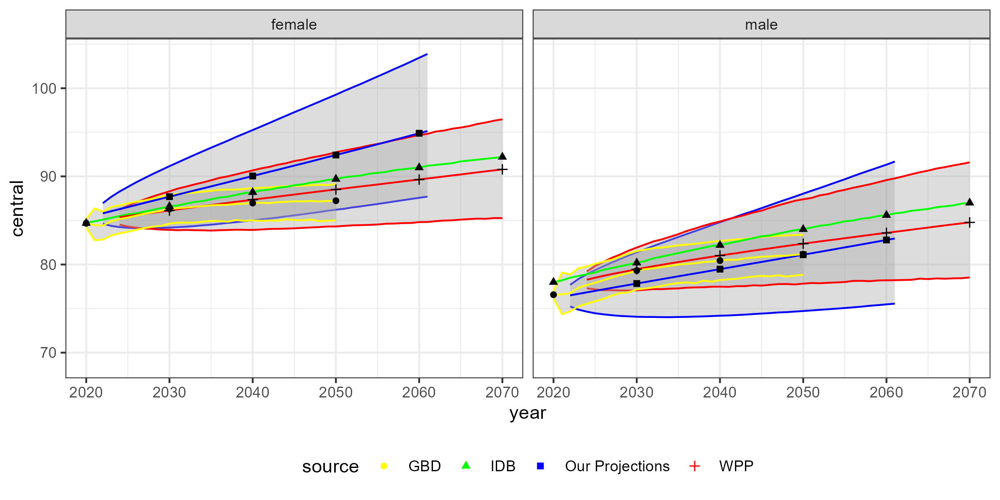
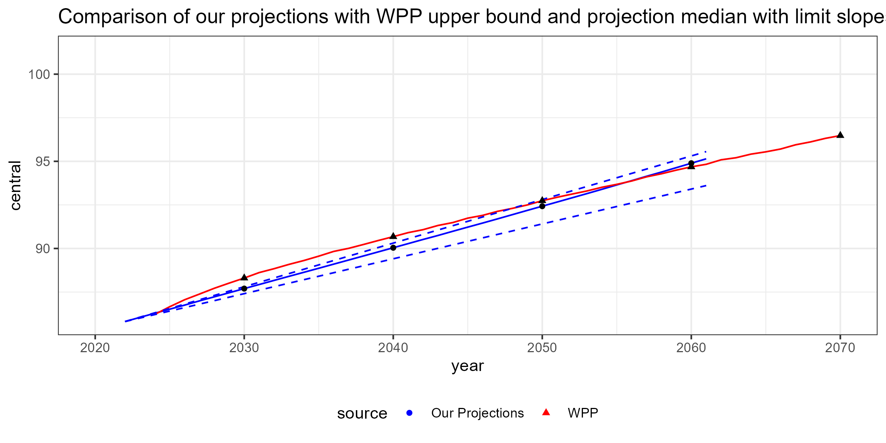
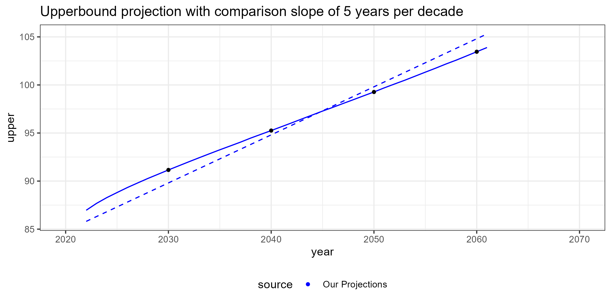
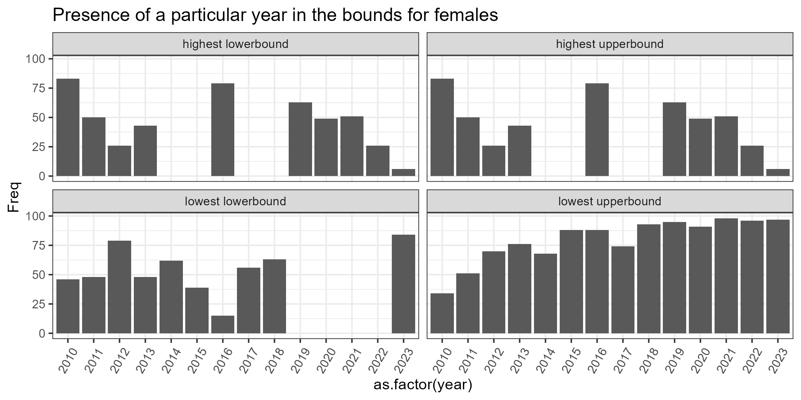
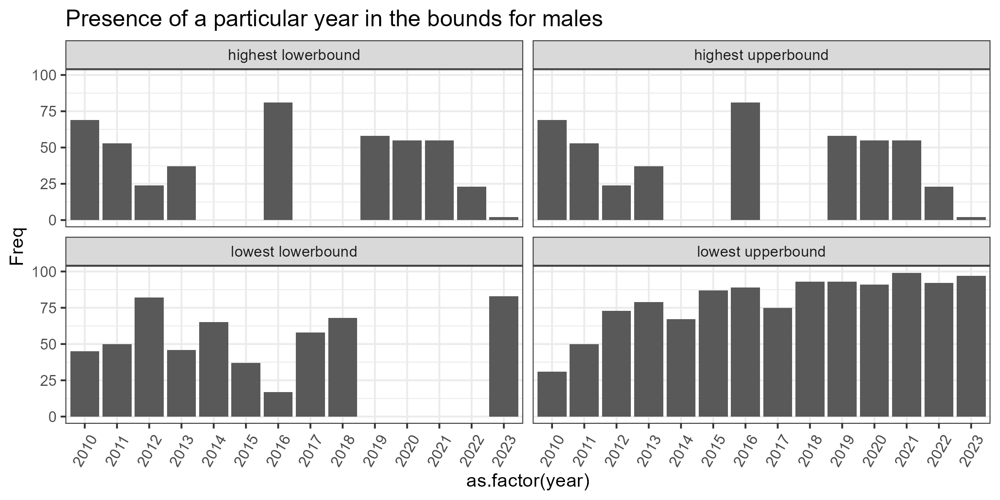

# Our benchmarks

Whe have already stated that there are no modern projections of mortality and life expectancy projections that are specific to Puerto Rico, so we will be comparing our results to three entities that do produce projections for the entire world, including Puerto Rico: the UN World Population Prospects (WPP), the U.S. Census Bureau’s International Data Base (IDB), and the University of Washington's Institute for Health Metrics and Evaluation (IHME). Each of these entities uses different methodologies and assumptions, so comparing our results to theirs will provide a useful context for understanding the implications of our projections.

The WPP projects mortality using a two-phase probabilistic model that combines historical trends with country-specific data and model life tables. It begins by projecting life expectancy at birth using a double-logistic function, capturing rapid improvements in early mortality followed by slower gains in older ages. For data-rich countries, the Lee-Carter method is applied to age-specific mortality rates, while for data-scarce countries, model life tables (e.g., Coale-Demeny or UN families) are calibrated using indicators like under five mortality and adjusted via the Calibrated Spline method. Regional benchmarks temper extreme trends such as rapid gains in fragile states or stagnation in advanced nations ensuring plausible long-term projections. The WPP also incorporates the impact of crises like pandemics and conflicts through excess mortality estimates, and uncertainty is quantified using prediction intervals. These mortality projections are then used in cohort-component models to forecast population change.

The IDB produces mortality and life expectancy projections for Puerto Rico and other global regions using a multi-step cohort-component methodology. Base mortality estimates are derived from high-quality data sources like vital registration systems, surveys and censuses, with adjustments for underenumeration, age heaping, and data quality issues. For countries with limited data, model life tables are used to estimate age and sex-specific mortality patterns. The IDB extends mortality projections to age 100+ using logistic functions to ensure smooth, realistic trends, even in the absence of empirical data. For countries affected by HIV/AIDS, the IDB employs a dual-scenario approach—modeling mortality under both “with AIDS” and “without AIDS” conditions using data from the UNAIDS Spectrum software to incorporate HIV prevalence and epidemic dynamics. Projections for future mortality are based on logistic curves fitted to historical life expectancy trends, with fixed slope models ensuring consistent long-term improvements, capped at 95 years for males and 100 for females by 2100. These projections are validated against demographic indicators and adjusted for shocks like wars, famines, and natural disasters, ensuring high precision in capturing the timing and impact of major events.

Finally, the IHME projects mortality using a data driven model that integrates the Socio-demographic Index, cause-specific risk factors from the Global Burden of Diseases study, and an ARIMA component to capture unexplained mortality trends. The model estimates underlying mortality as a function of SDI, time, and risk factors, while explicitly accounting for the interplay of risk factors such as tobacco, obesity, and air pollution. An ARIMA model with attenuated drift is used to project residual mortality, ensuring robust long-term forecasts without overfitting. This approach enables IHME to generate probabilistic, scenario-based projections for mortality and population, incorporating uncertainty across all components and providing a dynamic, causal framework distinct from more deterministic models used by other organizations.

## Comparison with External Benchmarks

With our actors and their methodologies defined, we can now compare our projections to theirs. The nature of the International Databases projections mean that they do not produce confidence intervals, so we will be comparing our median projections to their point estimates, while the WPP and IHME do produce confidence intervals that we can compare to ours. The IDB, WPP and our projections all produce climbing life expectancy projections, while the IHME produces a more modest increase that plateaus starting at 2045 for women and 2055 for men. The IHME projections cut off after 2050, in their report they state that they project life expectancy to 2100, but we were unable to find the data for Puerto Rico past 2050 and the behavior of their confidence intervals presents them as the outliers in the comparison, with a much narrower interval that does not grow with time, so we will be focusing on the WPP and IDB projections for the rest of the comparison.

When we see the then median of the male projections for the WPP and IDB, we see that they are quite close to our median projections, with our projections for 2061 running just below the WPP at 82 years the WPP at 83 years and the IDB at 85 years. Our intervals do behave differently with ours presenting much more uncertainty in the lower bound growing much faster than the WPP then curving back up, until the end of the projection period where it stops at 75 years while the WPP's lower bound reaches 78 years. The upper bound of our projections roughly tracks the WPP until it starts diverging upwards after 2045, reaching 91 years by 2061 while the WPP's upper bound reaches 89 years.

The male projections have a clear downwards drift ont he lower bound at the beginning of the projection period, but it presets a plausible trajectory given the much more erratic nature of male mortality i.e. its not shocking. What is shocking is the behavior of the female projections, where the median projection passes the upper bound of the WPP projections by the end of the projection period with ours reaching 94 years while the WPP reaches 90 years. The lower bound of our projections reaching 95 years with the IDB presenting 91 and the WPP 89. The upperbound for our projections reaches 103 years while the WPP reaches 94 years. and the lower bound of our projections reaches 87 years while the WPP reaches 84 years.

Oeppen and Vaubel stated in may 2002 that "best-practice life expectancy gains" have been about 2.5 years per decade[@oeppen2002broken], meanwhile Ronald Lee states its likely closer to 2.0 years per decade [@lee2002demographic]. If we graph those limits, we can see that our median projection for women exceeds the 2.0 year per decade limit stated by Ronald Lee, and approaches the 2.5 year per decade limit stated by Oeppen and Vaubel. This isn't even considering the upper bound of our projections, which exceeds the 2.5 year per decade limit by a wide margin, reaching 5.0 years per decade as we show below

## The Skewing of female mortality

Its well known that the Lee-Carter model can produce skewed projections for life expectancy, particularly for longer projection horizons, due to the way uncertainty in the $k_t$ index translates into life expectancy. In our projections for Puerto Rico, this skew is particularly pronounced and we have done some analysis to understand why that is the case. The usual suspects have been ruled out, as the model fit is good, the $b_x$ parameters are reasonable and the historical $k_t$ index does not show any unusual patterns that would suggest a structural break. Following those checks weve double checked the code, both verifying the implementation of the Lee-Carter model and the random walk with drift projection of $k_t$, we've iterated through all the parameters to see if any of them could be driving the skew. in fact, the the parameters themselves do little to change the structural shape of the projections, with both the median and the upperbound of female mortality showing unrealistic improvements in life expectancy at birth, while the lower bound shows a slightly more plausible trajectory under all scenarios.

The last remaining suspect is the source data its self. The data collection work in Puerto Rico is quite good compared to other countries in the region, but there have been recent events that have made data collection difficult. Looking deeper, we started narrowing down the source of the skew, first going decade by decade removing each decade from the data and seeing how it affected the projections. We narrowed it down to the period between 2010 and 2020. This period post the 2008 financial crisis, and includes the 2017 hurricane season was an obvious suspect candidate for introducing a structural break in the data along with the 2020 COVID-19 pandemic. Doing a similar exercise but removing every combination of years between 2010 and 2020 we produced the following visuals.

Explaining these visuals, after running every combination of years between 2010 and 2023 through our methodology, we sorted the upper and lower bounds of the projections and noted the eliminated years that corresponded. Of those, we took the 100 combinations that corresponded to the extremes of both upper and lower bonds. Since this gives us no structure, the half point of 50 is meaningless but the bars that approach both 100 ie its completely excluded and 0 ie its completely included are the ones that are more likely to be driving part of the skew. From the visuals, we can clearly see that there is a structural change in specifically the lowest upper bound projection. It requires the exclusion of most of the years from 2012 to 2023 with newer years being require to be removed in nearly all cases. 

We have no reason to believe that the data from 2010 to 2023 is inaccurate in any meaningfull way, but we do know that it was a period of significant disruption for Puerto Rico, with the financial crisis, the hurricanes and the pandemic all likely contributing to excess mortality. But the skew is in favor of improvements in life expectancy, which is the opposite of what we would expect from those events. Its also true that the island has gone through a drastic change in both healtcare reform and out migration, which could be driving some of the improvements in life expectancy, but the fact that the skew is so pronounced and that it is driven by the most recent data suggests that there may be some structural break in the data be it from the events themselves or from the way data was collected during the entire collection period. Further research is needed to understand the source of this skew, but it is important to note that the skew is not a modeling artifact but rather a reflection of the data and the events that have shaped mortality in Puerto Rico in recent years. The methodology used by the United Nations World Population Prospect is a much more developed model that incorporates a much larger context of data and events, so it is likely that their projections are more robust to these kinds of structural breaks, which may explain why their projections do not show the same skew as ours. 

## Model Performance and Limitations

### Pleateau in young males

It is well known that the young adult male population in Puerto Rico has been affected by high rates of violence and accidents, which has led to excess mortality in that age group. The Lee-Carter model captures this historical pattern through the $b_x$ parameters, which shows a very low sensitivity to changes in the $k_t$. Most of the enviromental change over the past decades have been in areas of healthcare and public health. It is likely that these changes have been canceled out by the excess mortality from violence and accidents, leading to a plateau in the projections for young males. But this is a known limitation of the Lee-Carter model, which does not account for changes in the underlying causes of mortality or for structural breaks in the data. The model assumes that the age-specific mortality rates will continue to evolve in a similar way to the past, which may not be the case for Puerto Rico given the unique challenges it faces.

### Future shocks

The model was able to properly capture the mortality shock of the mid 90s from HIV. However, the random walk with drift projection of the $k_t$ index does not allow for the anticipation of future shocks, which is a known limitation of the Lee-Carter model. This is particularly relevant for Puerto Rico, which has a history of hurricane-driven excess mortality. The model may not be able to capture the potential impact of future hurricanes or other natural disasters on mortality rates, which could lead to an overestimation of life expectancy in the long run.

## Broader Implications

Even if our projections out perform the benchmarks by an unrealistic margin, the data tells us two things. First, that there is a significant amount of uncertainty in the projections, particularly for females and particularly in the upper limits if mortality, which is reflected in the wide confidence intervals. This uncertainty is not just a modeling limitation but a reflection of the complex and dynamic nature of mortality trends in Puerto Rico, which are influenced by a wide range of factors including healthcare, public health, social and economic conditions, environmental and migratory factors. Second, that life expectancy in Puerto Rico is likely to continue to improve in the future, but the rate of improvement is uncertain and may be influenced by a wide range of factors that are difficult to predict. This has important implications for policymakers and planners, who need to be prepared for a range of possible scenarios when it comes to healthcare and social services for the aging population in Puerto Rico. The wide confidence intervals themselves are a finding — they communicate to policymakers that demographic uncertainty in Puerto Rico is not merely a modeling limitation but a genuine planning risk that demands scenario-based fiscal and healthcare planning rather than single-point forecasts.

Further more a deeper look into the source of the skew is needed to understand the underlying drivers of mortality trends in Puerto Rico and to improve the robustness of our projections. The two main data sets, local census estimates for population and the local health department for vital statistics, are the likely sources of the skew. The census might be overestimating the population on the latest decennial census which was done during the pandemic. But this would mean theirs a significant over counting of the population, leading to a much lower mortality rate over the past decade and the years that follow. There have been no vital statistics reports in the past years, but the health department reports to the national vital statistics system, so it is unlikely that there has been a significant under counting of deaths since were not filtering for any specific cause of death. Lastly the boogieman in demography in Puerto Rico is the out migration over the past decade. But for this to be the cause it requires that the population leaving specifically have a higher likelihood of dying than the population that remains, which is possible but we have no evidence to support nor believe this claim. Further research is needed to understand the source of the skew and to improve the robustness of our projections, but it is important to note that the skew is not a modeling artifact but rather a reflection of the data and the events that have shaped mortality in Puerto Rico in recent years. 

# Recomendations

The underlying model we used, the Lee-Carter model, is a widely used and well-established model for projecting mortality and life expectancy. Having said that, its clear that the model has limitations, particularly in the context of Puerto Rico where there are unique challenges and structural breaks in the data. As such our recommendation is to utilize the hierarchical Bayesian model developed by the United Nations World Population Prospects [@raftery2013bayesian], which incorporates a much larger context of data and events, and is likely to be more robust to the kinds of structural breaks that we have identified in our analysis. Having said that, the Lee-Carter model and this analysis still useful. The hierarchical Bayesian model is a much more complex model that requires a much larger amount of data and computational resources. While it does generate much more believable projections, one would not be able to identify the structural breaks in the data that we have identified with the Lee-Carter model, which is a useful finding in and of itself. The Lee-Carter model is also much more transparent and easier to understand and interpret, which can be useful for communicating the results to policymakers and stakeholders. 

# Future work

The next step in this project is to implement the hierarchical Bayesian model developed by the United Nations World Population Prospects [@raftery2013bayesian] and compare its projections to those generated by the Lee-Carter model. Additionally, the source of the skew in the projections needs to be further investigated, particularly in relation to the data from 2010 to 2023. This could involve a deeper analysis of the events that occurred during that period and how they may have impacted mortality trends in Puerto Rico, as well as an examination of the data collection methods and quality during that time. Finally, it would be useful to explore other modeling approaches that can account for structural breaks and changes in the underlying causes of mortality. This could include models that incorporate covariates related to healthcare, public health, social and economic conditions, environmental and migratory factors as we have not included any covariates in our projections. Finally, these projections should be used to inform scenario-based planning for healthcare and social services for the aging population in Puerto Rico, taking into account the wide range of possible outcomes and the significant uncertainty in the projections as well as serve as a stand-in for the more complex hierarchical Bayesian model until we are able to implement it.

# References

::: {#refs}
:::

