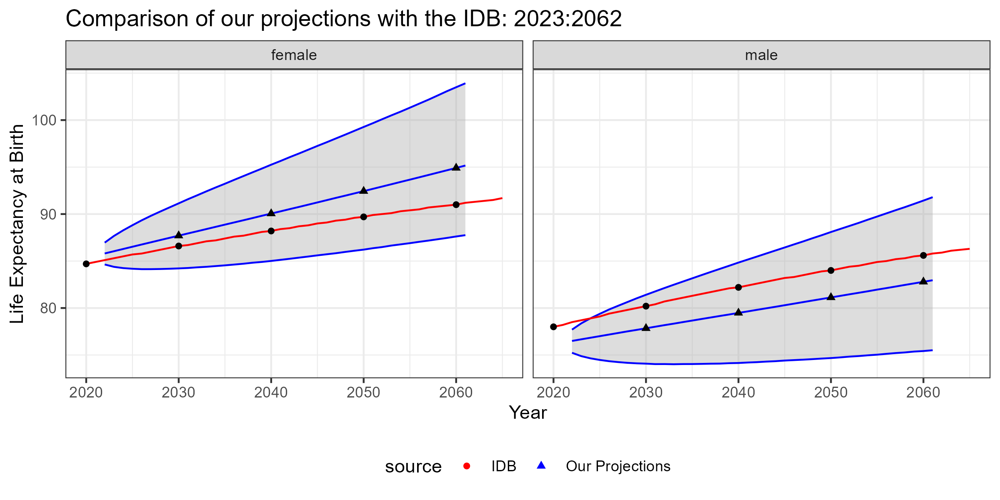
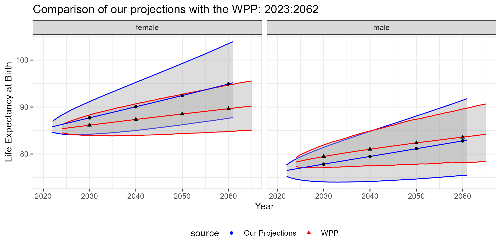
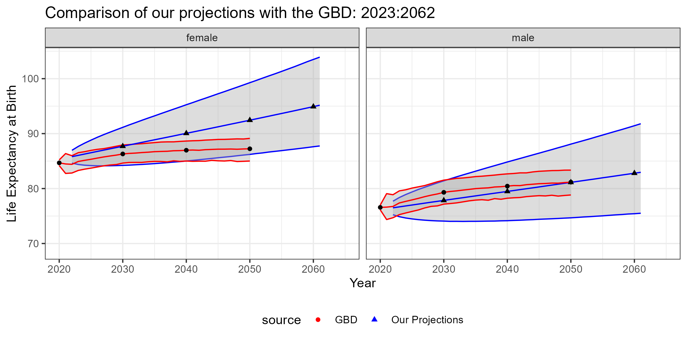

# Introduccion

## Background

Mortality projections serve as a foundational pillar in population
forecasting, standing alongside fertility and migration as one of the
three critical variables that determine the shape of our future
society[@preston2000demography]. They are essential for understanding
future demographic trends and planning for social services, healthcare,
and economic development[@kontis2017future]. They are a critically
important tool for policymakers, demographers, and researchers to
anticipate and respond to changes in population dynamics. The failure to
accurately project mortality rates can lead to significant
misallocations of resources and inadequate planning for future needs.

Within the balancing equation of demography, mortality serves as the
primary metric for assessing the health and survival limits of a
population. As global societies undergo a the epidemiological transition
characterized by a shift from infectious diseases to chronic and
age-related illness, the ability to forecast future survival patterns
has become essential for understanding broader demographic trends
[@omram2001epidemiologic; @vaupel2010biodemography]. Consequently,
mortality projections are no longer merely statistical exercises; they
are vital instruments for social planning, economic forecasting, and the
development of public health strategies.

For policymakers and researchers, these projections provide the
quantitative foundation required to anticipate and respond to the
challenges of an aging society. Specifically, accurate forecasts are
critical for the solvency of national pension systems and the longterm
sustainability of social security frameworks [@lee1992modeling;
@bengtsson2019old]. In the area of public health, projections allow for
the strategic allocation of resources toward geriatric care and the
management of non-communicable diseases that are common in older
populations [@christensen2009ageing]. Without robust data, governments
risk "longevity risk" the economic threat posed by populations living
significantly longer than anticipated by historical models
[@cairns2006two].

The historical record demonstrates that failing to accurately project
mortality can lead to severe structural consequences. For decades,
official forecasts consistently underestimated the pace of mortality
decline, particularly at older ages, leading to inadequate planning for
healthcare infrastructure and retirement funding [@oeppen2002broken;
@booth2006demographic]. This historical underestimation underscores the
necessity of moving beyond simple deterministic models toward modern
computerized tools and stochastic frameworks.

## Advances in Mortality Modeling

The transition from deterministic to stochastic modeling represents a
paradigm shift in the field of demographic forecasting. Historically,
mortality projections relied on deterministic methods, such as the
Gompertz-Makeham law of mortality or expert led "scenario based"
variants used by institutions like the United States Social Security
Administration. These older models often assumed a fixed rate of
improvement or relied on subjective "high," "medium," and "low"
scenarios that failed to capture the non-linear and age-specific nature
of mortality decline [@booth2006demographic]. Critically, deterministic
models offer no formal measure of uncertainty; they provide a single
trajectory that historically has proven to be consistently
over-conservative, leading to the repeated underestimation of life
expectancy gains at older ages [@lee2001evaluating].

The landmark introduction of the Lee-Carter model revolutionized the
field by shifting the focus from expert opinion to a data-driven,
statistical framework. The Lee-Carter method employs a stochastic
approach that decomposes the logarithm of age-specific death rates into
three components: an average age profile, a time varying mortality
index, and an age-specific response to that index. By using Singular
Value Decomposition (SVD) to extract the primary trend of mortality
change, the model allows the data itself to dictate the pace of decline
rather than imposing arbitrary limits on survival [@lee1992modeling].
This method has since become the "gold standard" in
demography[@girosi2008demographic].

Beyond its predictive accuracy, the primary value of the Lee-Carter
framework lies in its stochastic nature. Unlike deterministic models,
which offer a "best guess," stochastic models treat future mortality as
a random process with an associated probability distribution. By
modeling the time-varying index (kt) as a stochastic time series
typically a random walk with drift—researchers can generate
probabilistic intervals for future life expectancy. This quantification
of uncertainty is indispensable for modern risk management; it allows
policymakers and actuaries to calculate "longevity risk" and the
probability of extreme outcomes, such as a "95% confidence interval" for
the future old-age dependency ratio [@cairns2006two; @lee2000lee]. In a
21st-century context, where the pace of medical innovation and the
impact of global health crises are unpredictable, the ability to
communicate uncertainty through these probabilistic frameworks is no
longer a luxury, but a prerequisite for responsible fiscal and social
planning.

## Puerto Rico: Demographic Context and Gap in the Literature

Policymakers and public health officials in Puerto Rico need annual
stochastic mortality projections as part of producing annual
probabilistic population projections of the island population. The lack
of precise, forward looking mortality data has already manifested in
severe institutional challenges across Puerto Rico, most notably within
its social safety nets and fiscal frameworks. The island's retirement
systems offer a cautionary example of how demographic uncertainty can
lead to systemic collapse. For decades, the mismatch between projected
and actual dependency ratios, driven by a shrinking tax base and a
rapidly aging population, contributed to the total exhaustion of the
employees retirement system's trust funds [@abel2014causes;
@cox2019financial]. Because policymakers lacked robust, stochastic
projections to account for the accelerated pace of aging, the government
was eventually forced to transition to a "Pay As You Go" or "PayGo"
model. This shift has placed an enormous, immediate burden on the
central budget, where pension payments now compete directly with
essential services like education and public safety
[@wolfpopper2023extreme]. Furthermore, the inability to accurately
project mortality trends has complicated the island’s long term recovery
and debt restructuring efforts. Strategic documents, such as the
certified fiscal plans issued by the Financial Oversight and Management
Board, rely heavily on population forecasts to determine Puerto Rico’s
future debt paying capacity (Puerto Rico Fiscal Agency and Financial
Advisory Authority 2024)

This thesis will use the Lee-Carter model to first analyze the series
from 1950 to 2023 into its three components, the ax, bx, and kt
parameters by age and sex to obtain a deeper understanding of the
underlying mortality trends in Puerto Rico. Then, we will bootstrap the
parameters to create a distribution of possible future mortality
scenarios, which will allow us to create a stochastic forecast of
mortality rates and life expectancy at birth for the next 40 years.
Finally, we will compare our projections to those produced by the UN
World Population Prospects, the U.S. Census Bureau’s International Data
Base, and the University of Washington's Institute for Health Metrics
and Evaluation to contextualize our findings within the broader
landscape of demographic forecasting and asses the robustness of the
model, identify sources of uncertainty and bias in the projection and
provide evidence based recommendations for improving future Puerto Rico
specific mortality forecasting efforts

# Literary Review

```{r}
#| include: false
library(tidyverse)
library(glue)

bootstrap_residuals_ax <- rio::import('graphs/01_boot_residuals_ax.csv') 
bootstrap_residuals_bx <- rio::import('graphs/01_boot_residuals_bx.csv')
bootstrap_residuals_kt <- rio::import('graphs/01_boot_residuals_kt.csv')

simulated_kt <- rio::import('graphs/01_simulated_kt.csv')
deathrates <- rio::import('graphs/01_deathrates.csv')
lifetables <- rio::import('graphs/01_lifetables.csv')
```

## Lee Carter

The Lee-carter model was introduced in 1992 by Ronald Lee and Lawrence
Carter in their paper "Modeling and Forecasting U.S.
Mortality"[@lee1992modeling]. It revolutionized mortality forecasting by
providing a data-driven approach in lieu of the expert-led methods that
were previously dominant. Prior to its development, official forecasts
often underestimated the gains in human life expectancy
[@olshansky1988forecasting], creating a pressing need for more accurate
projections to assess the solvency of pension systems and social
security programs.

The model can be described simply with the equation
$ln(m_{x,t}) = a_x+b_xk_t+e_{x,t}$. More verbose, it states that the
natural log of the mortality rates of a given year $ln(m_{x,t})$ are
equivalent to the baseline mortality $a_x$ plus the product of the age
specific sensitivity to changes in mortality $b_x$ and the time varying
mortality index $k_t$ plus an error term $e_{x,t}$. To achieve this, Lee
and Carter applied Singular Value Decomposition (SVD) to extract the
characteristic pattern of mortality improvement over time. The solution
to the SVD is not unique, so they imposed two constraints: the sum of
$b_x$ across ages must equal 1, and the sum of $K_t$ across time must
equal 0. This allowed them to identify a unique solution that captured
the dominant trend in mortality improvement. Then by only taking the
first singular value and its corresponding vectors in $a_x$ and $b_x$,
they reduce the complexity of the data while retaining the most
important information. This serves as compression of the data reducing
the number of parameters needed to model mortality trends but keeping
the essential features of the data. Following this, the time-varying
mortality index $K_t$ is modeled as a random walk with drift, allowing
for the creation of objective prediction intervals that provided a
quantifiable measure of uncertainty. This was a significant departure
from previous "best-guess" forecasts, which lacked any formal way to
assess the range of possible outcomes.

The simplicity and robustness of the Lee-Carter model allowed it to
outperform contemporary models[@booth2006demographic], closely tracking
actual mortality data while older models significantly under-predicted
life expectancy gains. Its ability to capture the linear trend of
log-mortality decline across the 20th century made it particularly
effective for long-term forecasting. Unlike earlier parametric models
that focused on the biological shape of the mortality curve at a single
point in time, the Lee-Carter model prioritized the dynamic movement of
that curve over decades.

Thanks to the nature of the Lee-Carter model extensions and variations
have been developed to address its limitations and improve its accuracy.
For example, the LC-ER (Extended Rotation) method was developed to
account for "rotation" in mortality decline, which addresses implausible
age-pattern artifacts in vanilla LC projections. Additionally, the
stmomo R package[@villegas2018package], whose implementation we will be
using later, provides a flexible framework for mortality forecasting
using the Lee-Carter model as well as several other models, allowing
users to fit the model to various data types and generate forecasts
while assessing uncertainty.

The model and its extensions have been used in various applications,
including forecasting breast cancer mortality in China and
Pakistan[@Mubarik2023l], where it outperformed simpler models for the
screen-age/late-onset population (ages 50–84), revealing rising
mortality in Pakistan versus declining rates in China, which was used to
inform targeted healthcare interventions. The UN employs the LC model to
forecast global mortality trends, especially for long-term projections
up to 2100[@wpp2022methodology]. For high-life-expectancy countries like
Japan, the model was extended to account for “rotation” in mortality
decline (slowing improvements at young ages and accelerating declines at
older ages). This adjustment, termed the LC-ER (Extended Rotation)
method, addressed implausible age-pattern artifacts in vanilla LC
projections.

Now, when talking about the implementation we will be using, Stochastic
Mortality Modeling (stMoMo) is an R package that provides a
comprehensive framework for fitting and forecasting mortality models,
including the Lee-Carter model. Traditionally, mortality projections
followed deterministic frameworks — producing "high," "medium," and
"low" scenario variants that, while intuitive, offer no coherent
probabilistic interpretation and whose resulting ranges for vital rates
and population measures are inherently inconsistent with one another
[@lee1994stochastic]. Recognizing these limitations, the field has
progressively shifted toward stochastic approaches, in which uncertainty
is explicitly modeled and forecasts are expressed as probability
distributions over future outcomes. This transition has been formalized
at the institutional level: the 2015 edition of the UN World Population
Prospects marked a landmark departure from scenario-based projections
toward fully probabilistic ones, reflecting a broader consensus that
only stochastic methods can fully and coherently quantify forecasting
uncertainty [@alexander2024developing] The stMoMo package allows users
to easily fit the Lee-Carter model to their mortality data, generate
forecasts, and assess uncertainty through confidence intervals. It also
includes various extensions of the Lee-Carter model, such as the LC-ER
method, which can be used to improve the accuracy of forecasts for
high-life-expectancy countries. The package is designed to be
user-friendly and flexible, making it accessible for researchers and
practitioners in the field of mortality forecasting. For our use case,
we will be using the base Lee-Carter model and using its initial fit to
bootstrap its parameters to then simulate numerous forecasts to create a
distribution of possible outcomes. For this we need to set several
parameter. First would be the link function, which determines the random
component associated with the mortality model. The default link function
is the log link, this assumes that the deaths follow a Poisson
distribution, which is appropriate for count data like mortality.
Secondly, we need to set the restraints for the model to ensure
identifiability. For this we will set it as "sum". This ensures that
$\Sigma_t k_t=0$. With these two we can now create the seed fit for the
bootstrapping process. The bootstrap itself requires its own set of
parameters, these being the number of bootstrap samples, the approach to
be applied and the type of death to resample.

# Methodology

## The input matrix

Starting off with the input matrix, this is the matrix of log age
specific death rates that we will be using to fit the model. The matrix
is organized by age and year, with the log of the death rates for each
age group and year. Our original input data for this matrix comes in the
form of death counts and population exposures, which we then convert
into death rates by dividing the death counts by the population
exposures. Finally, we take the log of these death rates to create the
input matrix for the Lee-Carter model. The data comes from multiple
sources. The population estimates come from the US Census Bureau
decennial censuses divided into age groups and sex and interpolated for
the intercensal years using a linear spline. The mortality data is a
collage of multiple sources (Puerto Rico Department Of Health, WHO
database and the Center for Disease Control and Prevention. The data is
organized into 5-year age groups and single year of age for the first
year of life, and then 85+ for the last group.

We then pass this matrix to the stMoMo package to fit the Lee-Carter
model and extract the parameters. After several tests, we determined
that 100 samples generated properly distributed residuals, but for
robustness, we choose 500 to provide a more robust fit and still iterate
at an acceptable pace. Following this we proceed to the simulations. The
needed parameters for this are the number of simulations which we will
set as the same as the number of bootstraps, the years to project set at
40. The jump choice, whether to use the fitted end or the actual end, we
will choose the actual end in the data. Lastly for the simulation is the
method of the projection of kt. Our alternatives are multivariate random
walk with drift and an N independent arima models. The result of of this
is a series of 500 by 500 death rates for each of the 40 years to be
projected for every age group. We can then select the projections that
correspond to the median and the 97.5% and 2.5% quantiles to generate
out confidence intervals for the death rates per age grou, the first of
our final projects. Following this we can turn these into life tables to
generate our final product, the life expectancy at birth projections
with confidence intervals.

## The initial fit

### Fitted ax

Once the initial model fitting is completed, we have all our initial
products. The first of these, ax parameter, serves as the baseline
mortality for the population. It represents the average log mortality
rate for each age group across the entire time period. The ax parameter
captures the general shape of the mortality curve, which typically shows
high mortality rates at very young ages, a decline in mortality during
childhood and early adulthood, and then an increase in mortality as
people age. Ours graphs as follows.

{fig-align="center"}

Here, we can see the drastic fall of the baseline log mortality after
the first year of life. This is followed by the steady increase as one
ages and the telltale male mortality hump starting at the teen years
followed by a slow closing of the gap between the sexes as they age.

### Fitted bx

Next we have the bx parameter, which is our age specific sensitivity to
changes in the mortality index kt. The bx parameter captures how much
the log mortality rate for each age group changes in response to changes
in the mortality index kt. A higher bx value for a particular age group
indicates that the mortality rate for that age group is more sensitive
to changes in the overall mortality trend captured by kt. The bx
parameter typically shows a pattern where certain age groups, such as
infants and older adults, have higher sensitivity to changes in
mortality trends, while other age groups, such as young adults, may have
lower sensitivity. This reflects the fact that improvements in
healthcare and living conditions can have a more significant impact on
reducing mortality rates for certain age groups compared to others. In
other words this parameter tends to be context specific and can vary
significantly between populations and time periods. For our case, the bx
parameter graphs as follows.

{fig-align="center"}

Here we can see the sensitivity of the mortality index to changes in
mortality. The highest sensitivity is at early life. This is due to the
monumental work done on the island in the latter half of the 20th
century, better sanitation, better nutrition, and better healthcare. The
high point is followed by an significant drop for both sexes at the teen
years. Women then transition to a steady decline in sensitivity but
males continue to drop until near zero at the age of 20 finally making a
slow climb through to meet the female sensitivity at around 80 years of
age. This is a clear example of the context specific nature of the bx
parameter, as the sensitivity of mortality to changes in the overall
trend is not uniform across age groups and can be influenced by various
factors such as healthcare improvements, lifestyle changes, and social
determinants of health that affect different age groups differently. We
will specifficaly se the effect of the parameter in the death rates and
life expectancy projections later on, but for now we can move on to the
kt parameter, which is our time-varying mortality index.

### Fitted kt

The last of the initial fitted parameters, kt serves as the time-varying
mortality index that captures the overall trend in mortality improvement
over time. Historically, the kt parameter typically shows a declining
trend over time, reflecting improvements in healthcare, living
conditions, and other factors that contribute to reduced mortality
rates. The kt parameter can also exhibit fluctuations due to various
events such as epidemics, wars, or economic downturns that can
temporarily increase mortality rates. For our case, the kt parameter
graphs as follows.

{fig-align="center"}

The index corresponds to the average level of mortality for that year.
There are fluctuations in the index, a spike in the mid 1960s, the
effect of HIV in the mid 1990s [@calzada_sida_nodate] but the overall
trend is a steady decline. The index starts off higher for women than
men but they close the gap by the mid 1970 and start pulling apart as
time passes leading to an slow growing gap, but both share the same
general shape with the male and female indexes crossing in the mid
1970s.

## Parameter simulation

Now that we have the initial fit, we can move on to the simulations. We
provide the fitted parameters to the bootstrap method, which resamples
the parameters to create new sets of parameters. These new parameters
come with their own residuals to evaluate which we use to determine the
number of bootstraps needed to create a robust distribution. Earlier, we
stated that 500 samples were sufficient and these are the corresponding
residuals.

### ax residuals

{fig-align="center"}

```{r}
#| echo: false
#| fig-height: 6
#| fig-width: 10
sig_digits=4
knitr::kable(
    bootstrap_residuals_ax |> filter(age%%10==0) |> group_by(age, sex) |>
    mutate(Median = q_0500) |>
    mutate(Range=glue("({round(q_0025,sig_digits)} - {round(q_0975,sig_digits)})")) |>
    mutate(Range_Delta = q_0975-q_0025) |>
    select(c(age,sex,Median, Range,Range_Delta)) |> pivot_wider(names_from = sex, values_from = c(Median, Range,Range_Delta)) |> select(c(age, Median_male, Range_male, Range_Delta_male, Median_female, Range_female,Range_Delta_female)) |> 
    rename("Age"="age",
           "Median Male"="Median_male", "Range Male"= "Range_male", "Range Difference Male"="Range_Delta_male",           
           "Median Female"="Median_female", "Range Female"= "Range_female", "Range Difference Female"="Range_Delta_female")|>
        mutate(`Range Ratio` = round(`Range Difference Female` / `Range Difference Male`, 3))
    , align = "lccccccc", digits = sig_digits,caption = "Bootstrap residuals for ax")

```

Here we have the ax residuals of the bootstrap. It presents a large
deviance spike around childhood. For males this tapers quickly when
entering the teen years and continues to narrow through adulthood and
the senior years. Women on the other hand present a slower narrowing
into adulthood and further slows down past the 40 year mark. Looking at
the quantiles, at the median there's a clear skew towards opposite sides
of zero between the sexes and the range between the 95% quantiles
between men and woman are withing 20% of each other. In short both share
the same general shape of uncertainty with the males having a slight
offset towards the negative. This finally leads to males having a lower
baseline level of log mortality than females

### bx residuals

{fig-align="center"}

```{r}
#| echo: false
#| fig-height: 6
#| fig-width: 10
sig_digits=4
knitr::kable(
    bootstrap_residuals_bx |> filter(age%%10==0) |> group_by(age, sex) |>
    mutate(Median = q_0500) |>
    mutate(Range=glue("({round(q_0025,sig_digits)} - {round(q_0975,sig_digits)})")) |>
    mutate(Range_Delta = q_0975-q_0025) |>
    select(c(age,sex,Median, Range,Range_Delta)) |>
    pivot_wider(names_from = sex, values_from = c(Median, Range,Range_Delta)) |>
    select(c(age, Median_male, Range_male, Range_Delta_male, Median_female, Range_female,Range_Delta_female)) |> 
    rename("Age"="age",
           "Median Male"="Median_male", "Range Male"= "Range_male", "Range Difference Male"="Range_Delta_male",           
           "Median Female"="Median_female", "Range Female"= "Range_female", "Range Difference Female"="Range_Delta_female")|>
        mutate(`Range Ratio` = round(`Range Difference Female` / `Range Difference Male`, 3))
    , align = "lccccccc", digits = sig_digits,caption = "Bootstrap residuals for bx")

```

Moving on to the bx parameters bootstrap residuals, in many ways it
mirrors the ones from the ax parameter, with a large deviance spike
around childhood that tapers off as age progresses. However, unlike the
ax residuials, we see a clear difference in the range of the residuals
between sexes. For males, the residuals are much more spread out than
the female counterpart, with the 95% range ratio being ranging between
0.50 and 0.94, meaning that the male sensitivity to changes in the
mortality index is much more volatile than the female sensitivity.

### kt residuals

{fig-align="center"}

```{r}
#| echo: false
#| fig-height: 6
#| fig-width: 10
sig_digits=4
knitr::kable(
    bootstrap_residuals_kt |> filter(year%%10==0) |> group_by(year, sex) |>
    mutate(Median = q_0500) |>
    mutate(Range=glue("({round(q_0025,sig_digits)} - {round(q_0975,sig_digits)})")) |>
    mutate(Range_Delta = q_0975-q_0025) |>
    select(c(year,sex,Median, Range,Range_Delta)) |>
    pivot_wider(names_from = sex, values_from = c(Median, Range,Range_Delta)) |>
    select(c(year, Median_male, Range_male, Range_Delta_male, Median_female, Range_female,Range_Delta_female)) |> 
    rename("Year"="year",
           "Median Male"="Median_male", "Range Male"= "Range_male", "Range Difference Male"="Range_Delta_male",           
           "Median Female"="Median_female", "Range Female"= "Range_female", "Range Difference Female"="Range_Delta_female")|>
        mutate(`Range Ratio` = round(`Range Difference Female` / `Range Difference Male`, 3))
    , align = "lccccccc", digits = sig_digits,caption = "Bootstrap residuals for kt")
```

Moving on to the residuals for the kt variable, we see that unlike both
other parameters, kt slowly fans out over time. We also see the medians
are likewise, slowly climbing as time progresses unlike the two other
parameters and this is consistent for both sexes. Meanwhile the range
ratio between the sexes is shifting first skewed towards females but now
centers around 0.92.

## The forecast

Now, that we have the bootstrap parameters, we can now do the
simulations. The simulations are done by taking the bootstrapped
parameters and simulating the kt variable forward in time. This allows
us to create a distribution of possible future mortality scenarios based
on the uncertainty in the parameters. The results of the simulations can
be used to create confidence intervals for the future mortality rates.
The parameters that define the simulations are the number of
simulations, the years to project, the jump choice, and the method of
projection for kt. For our case, we set the number of simulations to
500, the same as the bootstrap samples, the years to project, 40 in our
case, the jump choice, the actual end in our data. The method of
projection for kt, either multivariate random walk with drift or iarima
models, the vast majority of literature uses the random walk and we have
no reason to deviate from this [@girosi2007understanding].

### Simulated kt

{fig-align="center"}

```{r}
#| echo: false
#| fig-height: 6
#| fig-width: 10
sig_digits=4
knitr::kable(
    simulated_kt |> filter(year%%10==0) |> group_by(year, sex) |>
    mutate(Median = q_0500) |>
    mutate(Range=glue("({round(q_0025,sig_digits)} - {round(q_0975,sig_digits)})")) |>
    mutate(Range_Delta = q_0975-q_0025) |>
    select(c(year,sex,Median, Range,Range_Delta)) |>
    pivot_wider(names_from = sex, values_from = c(Median, Range,Range_Delta)) |>
    select(c(year, Median_male, Range_male, Range_Delta_male, Median_female, Range_female,Range_Delta_female)) |> 
    rename("Year"="year",
           "Median Male"="Median_male", "Range Male"= "Range_male", "Range Difference Male"="Range_Delta_male",           
           "Median Female"="Median_female", "Range Female"= "Range_female", "Range Difference Female"="Range_Delta_female")|>
        mutate(`Range Ratio` = round(`Range Difference Female` / `Range Difference Male`, 3))
    , align = "lccccccc", digits = sig_digits,caption = "Kt simulations 2022-2050.")
```

Now, looking at the projections for the kt variable, we see that both
medians fall at a steady rate over time. As expected of the random walk
both ranges spread out over time, but the range ratio is steady between
sexes and roughly 1.1. Something of note is the behavior of the
projected median. It almost falls to the lower bound for both sexes,
which is a sign of a skewed distribution.

# Results

## Death rates

Now, with the kt projections, we can now calculate the first of our two
final products, the projected mortality rates for each age and sex by
using the ax and bx parameters. The projected mortality rates can be
calculated using the formula: $log(mortality_rate) = ax + bx * kt$. This
allows us to create a distribution of possible future mortality rates
based on the uncertainty in the parameters and the projections of kt.
The projected mortality rates can be used to create confidence intervals
for the future mortality rates.

```{r}
#| echo: false
#| fig-height: 6
#| fig-width: 10
sig_digits=4
knitr::kable(
    deathrates |> filter(year%%25==0) |> filter(age %in% c(20,40,60))|> filter( year >1999) |>
        arrange(sex,age,year) |>
        mutate(central = log(central)) |>
        mutate(upper = log(upper)) |>
        mutate(lower = log(lower))
    , align = "lccccccc", digits = sig_digits,caption = "Death Rates Historic and Forecasted 2020-2050.")
```

```{r}
#| echo: false
#| fig-height: 6
#| fig-width: 10

deathrates|>

        mutate(age_group = if_else( age<20, "Children",if_else(age>60, "Elderly","Adults"))
               ) |>
        mutate(age = as.factor(age))|>
        mutate(central = log(central)) |>
        mutate(upper = log(upper)) |>
        mutate(lower = log(lower)) |> ggplot() +
    geom_line(aes(x=year, y=central, color=age_group, group=age)) +
    facet_wrap(~sex) +
    labs(title = "Projected log mortality rates by age group and sex",
         x = "Year",
         y = "Log Mortality Rate") +
    theme_bw() +
    theme(legend.text = element_text(), legend.position = "bottom")
#
#
```

Here we have one of our final products, the death rates. Using the
median projection and dividing by age group and sex, we see that minors
in both sets are projected to have a continued accelerated mortality
decline through the projected period though their mortality is highly
erratic especially by the end of our historic data. Adult women are also
projected to have a continued decline in mortality but at a slower pace
than minors, while mortality is projected to plateau for young adult.
Those that survive to late adulthood are projected to continue their
decline in mortality but at a much slower pace than that of women.
Finally for both senior groups we see a continued decline in mortality
with women projected to have a much faster decline. One of the more
important things to note is that the original bx parameter describes
much of this graph. The high sensitivity of the minors to changes in the
mortality index kt means that they are projected to have a much faster
decline in mortality than the other age groups. The low sensitivity of
the young adults means that their mortality is projected to plateau,
while the moderate sensitivity of the adults and seniors means that they
are projected to have a continued decline in mortality but at a slower
pace than minors. Meanwhile the ax parameter is overwritten by our
explicitly requirement to force the projections to start at the actual
end of the data, so it does not have a direct effect on the projections
but it does have an indirect effect by influencing the initial fit of
the model and therefore the parameters that are used in the simulations.

## Life Tables and Life expectancy at birth

Now for the second final product. Proper life tables for both sexes and
the life expectancy at birth projected through the entire period.

```{r}
#| echo: false
#| fig-height: 6
#| fig-width: 10
sig_digits=4
knitr::kable(
    lifetables |> filter(year%%10==0) |> filter(year>1999) |> filter( age ==0) |>
        arrange(sex,year,age, type) |> filter(type %in% c("historic","central"))

    , align = "llcccccc", digits = sig_digits,caption = "Life Tables historic and Median Projection 2000-2060.")
```

```{r}
#| echo: false
#| fig-height: 6
#| fig-width: 10
ggplot() +
    geom_line(data=lifetables |> filter(type=="historic") |> filter(age==0),
              aes(x=year, y=ex, color="Historic Life Expectancy", group=sex, linetype = "solid" ))  +
    geom_line(data=lifetables |> filter(type=="upper")    |> filter(age==0),
              aes(x=year, y=ex, color="95% Interval",             group=sex, linetype = "dashed")) +
    geom_line(data=lifetables |> filter(type=="lower")    |> filter(age==0),
              aes(x=year, y=ex, color="95% Interval",             group=sex, linetype = "dashed")) +
    geom_line(data=lifetables |> filter(type=="central")  |> filter(age==0),
              aes(x=year, y=ex, color="Mean Forcast",             group=sex, linetype = "longdash" )) +
    facet_wrap(~sex) +
    scale_linetype_identity() +
    labs(title = "Projected Life Expectancy at Birth with 95% Confidence Intervals",
         x = "Year",
         y = "Life Expectancy at Birth (years)",
         color = "Projection Type") +
    scale_color_manual(values = c("Historic Life Expectancy" = "black","95% Interval"="blue","Mean Forcast"="red"))+
    theme_bw() 

```

Seeing the life expectancy at birth projections, we see that the
historic data shows a steady increase in life expectancy. The projected
values show this trend with a continued increase in life expectancy of
about 2.3 years per decade for women and 1.6 years per decade for men.
The median of the projection reaches 94 years for women and 82 for men.
The confidence intervals on the other hand present a curious picture.
The projection intervals are large enough to warrant a closer look, in
particular, the upper bound of the female life expectancy projection
presents linear growth and is projected to reach 104 years by 2060 and
male life expectancy reaches 92 year. The lower bound for both seem much
more plausible, with the female projection reaching 89 years and the
male 76.

# Discussion

## Our benchmarks

Whe have already stated that there are no modern projections of
mortality and life expectancy projections that are specific to Puerto
Rico, so we will be comparing our results to three entities that do
produce projections for the entire world, including Puerto Rico: the UN
World Population Prospects (WPP), the U.S. Census Bureau’s International
Data Base (IDB), and the University of Washington's Institute for Health
Metrics and Evaluation (IHME). Each of these entities uses different
methodologies and assumptions, so comparing our results to theirs will
provide a useful context for understanding the implications of our
projections.

The WPP projects mortality using a two-phase probabilistic model that
combines historical trends with country-specific data and model life
tables. It begins by projecting life expectancy at birth using a
double-logistic function, capturing rapid improvements in early
mortality followed by slower gains in older ages. For data-rich
countries, the Lee-Carter method is applied to age-specific mortality
rates, while for data-scarce countries, model life tables (e.g.,
Coale-Demeny or UN families) are calibrated using indicators like under
five mortality and adjusted via the Calibrated Spline method. Regional
benchmarks temper extreme trends such as rapid gains in fragile states
or stagnation in advanced nations ensuring plausible long-term
projections. The WPP also incorporates the impact of crises like
pandemics and conflicts through excess mortality estimates, and
uncertainty is quantified using prediction intervals. These mortality
projections are then used in cohort-component models to forecast
population change.

The IDB produces mortality and life expectancy projections for Puerto
Rico and other global regions using a multi-step cohort-component
methodology. Base mortality estimates are derived from high-quality data
sources like vital registration systems, surveys and censuses, with
adjustments for underenumeration, age heaping, and data quality issues.
For countries with limited data, model life tables are used to estimate
age and sex-specific mortality patterns. The IDB extends mortality
projections to age 100+ using logistic functions to ensure smooth,
realistic trends, even in the absence of empirical data. For countries
affected by HIV/AIDS, the IDB employs a dual-scenario approach—modeling
mortality under both “with AIDS” and “without AIDS” conditions using
data from the UNAIDS Spectrum software to incorporate HIV prevalence and
epidemic dynamics. Projections for future mortality are based on
logistic curves fitted to historical life expectancy trends, with fixed
slope models ensuring consistent long-term improvements, capped at 95
years for males and 100 for females by 2100. These projections are
validated against demographic indicators and adjusted for shocks like
wars, famines, and natural disasters, ensuring high precision in
capturing the timing and impact of major events.

Finally, the IHME projects mortality using a data driven model that
integrates the Socio-demographic Index, cause-specific risk factors from
the Global Burden of Diseases study, and an ARIMA component to capture
unexplained mortality trends. The model estimates underlying mortality
as a function of SDI, time, and risk factors, while explicitly
accounting for the interplay of risk factors such as tobacco, obesity,
and air pollution. An ARIMA model with attenuated drift is used to
project residual mortality, ensuring robust long-term forecasts without
overfitting. This approach enables IHME to generate probabilistic,
scenario-based projections for mortality and population, incorporating
uncertainty across all components and providing a dynamic, causal
framework distinct from more deterministic models used by other
organizations.

## Comparison with External Benchmarks

With our actors and their methodologies defined, we can now compare our
projections to theirs. The nature of the International Databases
projections mean that they do not produce confidence intervals, so we
will be comparing our median projections to their point estimates. In
the graph below, we can see that our median projections fall on opposite
ends of the IDB. Our female mortality projection starts slightly above
the IBDs point estimate and then diverges upwards slowly, while our male
mortality starts below the IDB point estimate point and keeps the gap
until the end of the projection period. In short, females will outpace
the IDB projections while the males will consistently lag behind the IDB
projections. In both cases, the IDB projections lie within our
confidence intervals.

 With the WPP, we can see a different
pattern. In our case, our median line for female life expectancy starts
above the WPP median but instead of tracking the WPP median, it diverges
upwards tracking the WPP upper bound, while our female upper bound
diverges even more upwards. For males, the story is more plausible, with
our male median starting below the WPP median but climbs faster than the
WPP median. The upper bound of our male projections tracks the WPP upper
bound until the second half of the projection period where it diverges
upwards, while the lower bound is always below the WPP lower bound. This
is a more plausible pattern.

 Finally, the IHME projections are much
more difficult to compare to our projections. They do provide confidence
intervals, but they dont produce the tipycal fanning out of the
confidence intervals that we would expect from a stochastic model.
Instead, their confidence intervals are much more narrow and they dont
show the same pattern of divergence that we see in our projections.
Their model implies that there will be a plateauing of life expectancy
for both males and females in the 2040s, while every other projection,
including ours, shows a continued increase in life expectancy through
the end of the projection period. This is a significant divergence from
our projections and the other benchmarks. That being said, the IHME
projections generally lie within our confidence intervals, though our
medians behave very differently from the IHME medians, with our medians
showing a continued increase in life expectancy while the IHME medians
show a plateauing of life expectancy. This is a significant divergence
from our projections and the other benchmarks.


When we see the then median of the male projections for the WPP and IDB,
we see that they are quite close to our median projections, with our
projections for 2061 running just below the WPP at 82 years the WPP at
83 years and the IDB at 85 years. Our intervals do behave differently
with ours presenting much more uncertainty in the lower bound growing
much faster than the WPP then curving back up, until the end of the
projection period where it stops at 75 years while the WPP's lower bound
reaches 78 years. The upper bound of our projections roughly tracks the
WPP until it starts diverging upwards after 2045, reaching 91 years by
2061 while the WPP's upper bound reaches 89 years.

The male projections have a clear downwards drift ont he lower bound at
the beginning of the projection period, but it presets a plausible
trajectory given the much more erratic nature of male mortality i.e. its
not shocking. What is shocking is the behavior of the female
projections, where the median projection passes the upper bound of the
WPP projections by the end of the projection period with ours reaching
94 years while the WPP reaches 90 years. The lower bound of our
projections reaching 95 years with the IDB presenting 91 and the WPP 89.
The upperbound for our projections reaches 103 years while the WPP
reaches 94 years. and the lower bound of our projections reaches 87
years while the WPP reaches 84 years.

Oeppen and Vaubel stated in may 2002 that "best-practice life expectancy
gains" have been about 2.5 years per decade[@oeppen2002broken],
meanwhile Ronald Lee states its likely closer to 2.0 years per decade
[@lee2002demographic]. If we graph those limits, we can see that our
median projection for women exceeds the 2.0 year per decade limit stated
by Ronald Lee, and approaches the 2.5 year per decade limit stated by
Oeppen and Vaubel. This isn't even considering the upper bound of our
projections, which exceeds the 2.5 year per decade limit by a wide
margin, reaching 5.0 years per decade as we show below


## The Skewing of female mortality

Its well known that the Lee-Carter model can produce skewed projections
for life expectancy, particularly for longer projection horizons, due to
the way uncertainty in the $k_t$ index translates into life expectancy.
In our projections for Puerto Rico, this skew is particularly pronounced
and we have done some analysis to understand why that is the case. The
usual suspects have been ruled out, as the model fit is good, the $b_x$
parameters are reasonable and the historical $k_t$ index does not show
any unusual patterns that would suggest a structural break. Following
those checks weve double checked the code, both verifying the
implementation of the Lee-Carter model and the random walk with drift
projection of $k_t$, we've iterated through all the parameters to see if
any of them could be driving the skew. in fact, the the parameters
themselves do little to change the structural shape of the projections,
with both the median and the upperbound of female mortality showing
unrealistic improvements in life expectancy at birth, while the lower
bound shows a slightly more plausible trajectory under all scenarios.

## Model Performance and Limitations

### Pleateau in young males

It is well known that the young adult male population in Puerto Rico has
been affected by high rates of violence and accidents, which has led to
excess mortality in that age group. The Lee-Carter model captures this
historical pattern through the $b_x$ parameters, which shows a very low
sensitivity to changes in the $k_t$. Most of the enviromental change
over the past decades have been in areas of healthcare and public
health. It is likely that these changes have been canceled out by the
excess mortality from violence and accidents, leading to a plateau in
the projections for young males. But this is a known limitation of the
Lee-Carter model, which does not account for changes in the underlying
causes of mortality or for structural breaks in the data. The model
assumes that the age-specific mortality rates will continue to evolve in
a similar way to the past, which may not be the case for Puerto Rico
given the unique challenges it faces.

### Future shocks

The model was able to properly capture the mortality shock of the mid
90s from HIV. However, the random walk with drift projection of the
$k_t$ index does not allow for the anticipation of future shocks, which
is a known limitation of the Lee-Carter model. This is particularly
relevant for Puerto Rico, which has a history of hurricane-driven excess
mortality. The model may not be able to capture the potential impact of
future hurricanes or other natural disasters on mortality rates, which
could lead to an overestimation of life expectancy in the long run.

## Broader Implications

Even if our projections out perform the benchmarks by an unrealistic
margin, the data tells us two things. First, that there is a significant
amount of uncertainty in the projections, particularly for females and
particularly in the upper limits if mortality, which is reflected in the
wide confidence intervals. This uncertainty is not just a modeling
limitation but a reflection of the complex and dynamic nature of
mortality trends in Puerto Rico, which are influenced by a wide range of
factors including healthcare, public health, social and economic
conditions, environmental and migratory factors. Second, that life
expectancy in Puerto Rico is likely to continue to improve in the
future, but the rate of improvement is uncertain and may be influenced
by a wide range of factors that are difficult to predict. This has
important implications for policymakers and planners, who need to be
prepared for a range of possible scenarios when it comes to healthcare
and social services for the aging population in Puerto Rico. The wide
confidence intervals themselves are a finding — they communicate to
policymakers that demographic uncertainty in Puerto Rico is not merely a
modeling limitation but a genuine planning risk that demands
scenario-based fiscal and healthcare planning rather than single-point
forecasts.

Further more a deeper look into the source of the skew is needed to
understand the underlying drivers of mortality trends in Puerto Rico and
to improve the robustness of our projections. The two main data sets,
local census estimates for population and the local health department
for vital statistics, are the likely sources of the skew. The census
might be overestimating the population on the latest decennial census
which was done during the pandemic. But this would mean theirs a
significant over counting of the population, leading to a much lower
mortality rate over the past decade and the years that follow. There
have been no vital statistics reports in the past years, but the health
department reports to the national vital statistics system, so it is
unlikely that there has been a significant under counting of deaths
since were not filtering for any specific cause of death. Lastly the
boogieman in demography in Puerto Rico is the out migration over the
past decade. But for this to be the cause it requires that the
population leaving specifically have a higher likelihood of dying than
the population that remains, which is possible but we have no evidence
to support nor believe this claim. Further research is needed to
understand the source of the skew and to improve the robustness of our
projections, but it is important to note that the skew is not a modeling
artifact but rather a reflection of the data and the events that have
shaped mortality in Puerto Rico in recent years.

# Recomendations

The underlying model we used, the Lee-Carter model, is a widely used and
well-established model for projecting mortality and life expectancy.
Having said that, its clear that the model has limitations, particularly
in the context of Puerto Rico where there are unique challenges and
structural breaks in the data. As such our recommendation is to utilize
the hierarchical Bayesian model developed by the United Nations World
Population Prospects [@raftery2013bayesian], which incorporates a much
larger context of data and events, and is likely to be more robust to
the kinds of structural breaks that we have identified in our analysis.
Having said that, the Lee-Carter model and this analysis still useful.
The hierarchical Bayesian model is a much more complex model that
requires a much larger amount of data and computational resources. While
it does generate much more believable projections, one would not be able
to identify the structural breaks in the data that we have identified
with the Lee-Carter model, which is a useful finding in and of itself.
The Lee-Carter model is also much more transparent and easier to
understand and interpret, which can be useful for communicating the
results to policymakers and stakeholders.

# Future work

The next step in this project is to implement the hierarchical Bayesian
model developed by the United Nations World Population Prospects
[@raftery2013bayesian] and compare its projections to those generated by
the Lee-Carter model. Additionally, the source of the skew in the
projections needs to be further investigated, particularly in relation
to the data from 2010 to 2023. This could involve a deeper analysis of
the events that occurred during that period and how they may have
impacted mortality trends in Puerto Rico, as well as an examination of
the data collection methods and quality during that time. Finally, it
would be useful to explore other modeling approaches that can account
for structural breaks and changes in the underlying causes of mortality.
This could include models that incorporate covariates related to
healthcare, public health, social and economic conditions, environmental
and migratory factors as we have not included any covariates in our
projections. Finally, these projections should be used to inform
scenario-based planning for healthcare and social services for the aging
population in Puerto Rico, taking into account the wide range of
possible outcomes and the significant uncertainty in the projections as
well as serve as a stand-in for the more complex hierarchical Bayesian
model until we are able to implement it.

# References

::: {#refs}
:::

# Apendix
```{r}
#| echo: false
#| message: false
#| warning: false
year_filter <- c(1950,2000,2010,2020,2022,2030,2050,2062)
age_filter <- c(0,20,40,60,80)

#age_filter <- seq(0,100, by=20)
#year_filter <- seq(1950,2062, by=10) 
```
## Tables

#### Summary of Death Rates

```{r}
#| echo: false
#| message: false
#| warning: false
#| fig-height: 6
#| fig-width: 10
sig_digits=4
rates <- rio::import("graphs/01_rates.csv")
tmp <- rates |>  filter( type == "historic" ) |> select(c(year,age,central,sex))|> rename("death rate"=central) |> pivot_wider(names_from =sex, values_from = "death rate")|> arrange(year,age) |> filter(year %in% year_filter) |> filter(age %in% age_filter)
n_cols <- 2
n   <- nrow(tmp)
idx <- floor(n / n_cols)

col1 <- tmp[1:idx, ]
col2 <- tmp[(idx + 1):(2 * idx),]

rownames(col1) <- rownames(col2) <- NULL

library(kableExtra)

knitr::kable(
  cbind(col1, col2),
  col.names = c(rep(colnames(tmp), n_cols)),
      na        = "",
  caption = "Death Rates Puerto Rico Historic: 1950-2021.",
  align = paste(rep("llcc", n_cols), collapse = ""),
  digits = sig_digits,
  booktabs  = TRUE      # cleaner lines in PDF
) |>
    kableExtra::kable_styling(
    latex_options = c("hold_position", "scale_down"),  # PDF
    full_width    = FALSE
  ) |>
  collapse_rows(
    columns  = c(1,5),          # which column(s) to collapse
    valign   = "middle"    # vertical alignment: "top", "middle", "bottom"
  ) |> 
    kable_styling(font_size = 10)


```
\newpage
```{r}
#| echo: false
#| message: false
#| warning: false
#| fig-height: 6
#| fig-width: 10
sig_digits=4
rates <- rio::import("graphs/01_rates.csv")
tmp <- rates |>  filter( type == "forecast" ) |> select(c(year,age,central,sex))|> rename("death rate"=central) |> pivot_wider(names_from =sex, values_from = "death rate")|> arrange(year,age) |> filter(year %in% year_filter) |> filter(age %in% age_filter)
n_cols <- 2
n   <- nrow(tmp)
idx <- ceiling(n / n_cols)

col1 <- tmp[1:idx, ]
col2 <- tmp[(idx + 1):(2 * idx),]

rownames(col1) <- rownames(col2) <- NULL

library(kableExtra)

knitr::kable(
  cbind(col1, col2),
  col.names = c(rep(colnames(tmp), n_cols)),
      na        = "",
  caption = "Death Rates Puerto Rico Projections:Median 2022-2062.",
  align = paste(rep("llcc", n_cols), collapse = ""),
  digits = sig_digits,
  booktabs  = TRUE      # cleaner lines in PDF
) |>
    kableExtra::kable_styling(
    latex_options = c("hold_position", "scale_down"),  # PDF
    full_width    = FALSE
  ) |>  collapse_rows(
    columns  = c(1,5),          # which column(s) to collapse
    valign   = "middle"    # vertical alignment: "top", "middle", "bottom"
  )|> 
    kable_styling(font_size = 10)

```

\newpage

```{r}
#| echo: false
#| message: false
#| warning: false
#| fig-height: 6
#| fig-width: 10
sig_digits=4
rates <- rio::import("graphs/01_rates.csv")
tmp <- rates |>  filter( type == "forecast" ) |> select(c(year,age,upper,sex))|> rename("death rate"=upper) |> pivot_wider(names_from =sex, values_from = "death rate")|> arrange(year,age) |> filter(year %in% year_filter) |> filter(age %in% age_filter)
n_cols <- 2
n   <- nrow(tmp)
idx <- ceiling(n / n_cols)

col1 <- tmp[1:idx, ]
col2 <- tmp[(idx + 1):(2 * idx),]

rownames(col1) <- rownames(col2) <- NULL

library(kableExtra)

knitr::kable(
  cbind(col1, col2),
  col.names = c(rep(colnames(tmp), n_cols)),
      na        = "",
  caption = "Death Rates Puerto Rico Projections:97.5 Percentile 2022-2062.",
  align = paste(rep("llcc", n_cols), collapse = ""),
  digits = sig_digits,
  booktabs  = TRUE      # cleaner lines in PDF
) |>
    kableExtra::kable_styling(
    latex_options = c("hold_position", "scale_down"),  # PDF
    full_width    = FALSE
  ) |>
    collapse_rows(
    columns  = c(1,5),          # which column(s) to collapse
    valign   = "middle"    # vertical alignment: "top", "middle", "bottom"
  )|> 
    kable_styling(font_size = 10)

```
\newpage

```{r}
#| echo: false
#| message: false
#| warning: false
#| fig-height: 6
#| fig-width: 10
sig_digits=4
rates <- rio::import("graphs/01_rates.csv")
tmp <- rates |>  filter( type == "forecast" ) |> select(c(year,age,lower,sex))|> rename("death rate"=lower) |> pivot_wider(names_from =sex, values_from = "death rate")|> arrange(year,age) |> filter(year %in% year_filter) |> filter(age %in% age_filter)
n_cols <- 2
n   <- nrow(tmp)
idx <- ceiling(n / n_cols)

col1 <- tmp[1:idx, ]
col2 <- tmp[(idx + 1):(2 * idx),]

rownames(col1) <- rownames(col2) <- NULL

library(kableExtra)

knitr::kable(
  cbind(col1, col2),
  col.names = c(rep(colnames(tmp), n_cols)),
      na        = "",
  caption = "Death Rates Puerto Rico Projections:2.5 Percentile 2022-2062.",
  align = paste(rep("llcc", n_cols), collapse = ""),
  digits = sig_digits,
  booktabs  = TRUE      # cleaner lines in PDF
) |>
    kableExtra::kable_styling(
    latex_options = c("hold_position", "scale_down"),  # PDF
    full_width    = FALSE
  ) |>
    collapse_rows(
    columns  = c(1,5),          # which column(s) to collapse
    valign   = "middle"    # vertical alignment: "top", "middle", "bottom"
  )|> 
    kable_styling(font_size = 10)

```
\newpage

#### Summary of Lifetables

```{r}
#| echo: false
#| message: false
#| warning: false
#| fig-height: 6
#| fig-width: 10
sig_digits=4
lt <- rio::import("graphs/01_lifetables.csv")
male   <- lt |>  filter( type == "historic" ) |> filter(year %in% year_filter) |> filter(age %in% age_filter) |> filter(sex=="male")  |> select(-c(type, sex))
female <- lt |>  filter( type == "historic" ) |> filter(year %in% year_filter) |> filter(age %in% age_filter) |> filter(sex=="female")|> select(-c(type, sex))
```
```{r}
#| echo: false
#| message: false
#| warning: false
#| fig-height: 6
#| fig-width: 10
knitr::kable(
  male,
  col.names = colnames(male),
      na        = "",
  caption = "Life Table Male Historic 1950-2021.",
  align = paste(rep("llcc", n_cols), collapse = ""),
  digits = sig_digits,
  booktabs  = TRUE      # cleaner lines in PDF
)|>
    kableExtra::kable_styling(
    latex_options = c("hold_position", "scale_down"),  # PDF
    full_width    = FALSE
  )|>  
    collapse_rows(
    columns  = c(1,5),          # which column(s) to collapse
    valign   = "middle"    # vertical alignment: "top", "middle", "bottom"
  )|> 
    kable_styling(font_size = 10)
```
\newpage

```{r}
#| echo: false
#| message: false
#| warning: false
#| fig-height: 6
#| fig-width: 10

knitr::kable(
  female,
  col.names = colnames(female),
      na        = "",
  caption = "Life Table Female Historic 1950-2021.",
  align = paste(rep("llcc", n_cols), collapse = ""),
  digits = sig_digits,
  booktabs  = TRUE      # cleaner lines in PDF
)|>
    kableExtra::kable_styling(
    latex_options = c("hold_position", "scale_down"),  # PDF
    full_width    = FALSE
  )|>  
    collapse_rows(
    columns  = c(1,5),          # which column(s) to collapse
    valign   = "middle"    # vertical alignment: "top", "middle", "bottom"
  )|> 
    kable_styling(font_size = 10)

```
\newpage

```{r}
#| echo: false
#| message: false
#| warning: false
#| fig-height: 6
#| fig-width: 10

sig_digits=4
lt <- rio::import("graphs/01_lifetables.csv")
male   <- lt |>  filter( type == "central" ) |> filter(year %in% year_filter) |> filter(age %in% age_filter) |> filter(sex=="male")  |> select(-c(type, sex))
female <- lt |>  filter( type == "central" ) |> filter(year %in% year_filter) |> filter(age %in% age_filter) |> filter(sex=="female")|> select(-c(type, sex))

```
\newpage

```{r}
#| echo: false
#| message: false
#| warning: false
#| fig-height: 6
#| fig-width: 10


knitr::kable(
  male,
  col.names = colnames(male),
      na        = "",
  caption = "Lifetable Male Projected Median 2022-2062.",
  align = paste(rep("llcc", n_cols), collapse = ""),
  digits = sig_digits,
  booktabs  = TRUE      # cleaner lines in PDF
)|>
    kableExtra::kable_styling(
    latex_options = c("hold_position", "scale_down"),  # PDF
    full_width    = FALSE
  )|>  
    collapse_rows(
    columns  = c(1,5),          # which column(s) to collapse
    valign   = "middle"    # vertical alignment: "top", "middle", "bottom"
  )|> 
    kable_styling(font_size = 10)
```
\newpage

```{r}
#| echo: false
#| message: false
#| warning: false
#| fig-height: 6
#| fig-width: 10

knitr::kable(
  female,
  col.names = colnames(female),
      na        = "",
  caption = "Lifetable Female Projected Median 2022-2062.",
  align = paste(rep("llcc", n_cols), collapse = ""),
  digits = sig_digits,
  booktabs  = TRUE      # cleaner lines in PDF
)|>
    kableExtra::kable_styling(
    latex_options = c("hold_position", "scale_down"),  # PDF
    full_width    = FALSE
  )|>  
    collapse_rows(
    columns  = c(1,5),          # which column(s) to collapse
    valign   = "middle"    # vertical alignment: "top", "middle", "bottom"
  )|> 
    kable_styling(font_size = 10)

```
\newpage

```{r}
#| echo: false
#| message: false
#| warning: false
#| fig-height: 6
#| fig-width: 10


sig_digits=4
lt <- rio::import("graphs/01_lifetables.csv")
male   <- lt |>  filter( type == "upper" ) |> filter(year %in% year_filter) |> filter(age %in% age_filter) |> filter(sex=="male")  |> select(-c(type, sex))
female <- lt |>  filter( type == "upper" ) |> filter(year %in% year_filter) |> filter(age %in% age_filter) |> filter(sex=="female")|> select(-c(type, sex))
```
\newpage

```{r}
#| echo: false
#| message: false
#| warning: false
#| fig-height: 6
#| fig-width: 10

knitr::kable(
  male,
  col.names = colnames(male),
      na        = "",
  caption = "Lifetable Male Projected 97.5 Percentile 2022-2062.",
  align = paste(rep("llcc", n_cols), collapse = ""),
  digits = sig_digits,
  booktabs  = TRUE      # cleaner lines in PDF
)|>
    kableExtra::kable_styling(
    latex_options = c("hold_position", "scale_down"),  # PDF
    full_width    = FALSE
  )|>  
    collapse_rows(
    columns  = c(1,5),          # which column(s) to collapse
    valign   = "middle"    # vertical alignment: "top", "middle", "bottom"
  )|> 
    kable_styling(font_size = 10)
```
\newpage
```{r}
#| echo: false
#| message: false
#| warning: false
#| fig-height: 6
#| fig-width: 10

knitr::kable(
  female,
  col.names = colnames(female),
      na        = "",
  caption = "Lifetable Female Projected 97.5 Percentile 2022-2062.",
  align = paste(rep("llcc", n_cols), collapse = ""),
  digits = sig_digits,
  booktabs  = TRUE      # cleaner lines in PDF
)|>
    kableExtra::kable_styling(
    latex_options = c("hold_position", "scale_down"),  # PDF
    full_width    = FALSE
  )|>  
    collapse_rows(
    columns  = c(1,5),          # which column(s) to collapse
    valign   = "middle"    # vertical alignment: "top", "middle", "bottom"
  )|> 
    kable_styling(font_size = 10)
```
\newpage
```{r}
#| echo: false
#| message: false
#| warning: false
#| fig-height: 6
#| fig-width: 10
sig_digits=4
lt <- rio::import("graphs/01_lifetables.csv")
male   <- lt |>  filter( type == "lower" ) |> filter(year %in% year_filter) |> filter(age %in% age_filter) |> filter(sex=="male")  |> select(-c(type, sex))
female <- lt |>  filter( type == "lower" ) |> filter(year %in% year_filter) |> filter(age %in% age_filter) |> filter(sex=="female")|> select(-c(type, sex))
```
\newpage

```{r}
#| echo: false
#| message: false
#| warning: false
#| fig-height: 6
#| fig-width: 10
knitr::kable(
  male,
  col.names = colnames(male),
      na        = "",
  caption = "Lifetable Male Projected 2.5 Percentile 2022-2062.",
  align = paste(rep("llcc", n_cols), collapse = ""),
  digits = sig_digits,
  booktabs  = TRUE      # cleaner lines in PDF
)|>
    kableExtra::kable_styling(
    latex_options = c("hold_position", "scale_down"),  # PDF
    full_width    = FALSE
  )|>  
    collapse_rows(
    columns  = c(1,5),          # which column(s) to collapse
    valign   = "middle"    # vertical alignment: "top", "middle", "bottom"
  )|> 
    kable_styling(font_size = 10)

```
\newpage


```{r}
#| echo: false
#| message: false
#| warning: false
#| fig-height: 6
#| fig-width: 10
knitr::kable(
  female,
  col.names = colnames(female),
      na        = "",
  caption = "Lifetable Female Projected 2.5 Percentile 2022-2062.",
  align = paste(rep("llcc", n_cols), collapse = ""),
  digits = sig_digits,
  booktabs  = TRUE      # cleaner lines in PDF
)|>
    kableExtra::kable_styling(
    latex_options = c("hold_position", "scale_down"),  # PDF
    full_width    = FALSE
  )|>  
    collapse_rows(
    columns  = c(1,5),          # which column(s) to collapse
    valign   = "middle"    # vertical alignment: "top", "middle", "bottom"
  )|> 
    kable_styling(font_size = 10)

```
\newpage

### Life Expectancy at Birth
```{r}
#| echo: false
#| message: false
#| warning: false
#| fig-height: 6
#| fig-width: 10
sig_digits=4
lt <- rio::import("graphs/01_lifetables.csv")
tmp   <- lt |>  filter( type == "historic" ) |> filter(age ==0)  |> select(c(year,ex,sex)) |> pivot_wider(names_from =sex, values_from = ex) |> arrange(year)

n_cols <- 3
n   <- nrow(tmp)
idx <- ceiling(n / n_cols)

col1 <- tmp[1:idx, ]
col2 <- tmp[(idx + 1):(2 * idx),]
col3 <- tmp[(2 * idx + 1):n, ]
tmp <- cbind(col1, col2, col3)
colnames(tmp) <- c(colnames(col1), colnames(col2), colnames(col3))


knitr::kable(
    tmp,

  col.names = colnames(tmp),
      na        = "",
  caption = "Life Expectancy at Birth Historic 1950-2021.",
  align = paste(rep("ccc", n_cols), collapse = ""),
  digits = sig_digits,
  booktabs  = TRUE      # cleaner lines in PDF
)|>
    kableExtra::kable_styling(
    latex_options = c("hold_position", "scale_down"),  # PDF
    full_width    = FALSE
  )|> 
    kable_styling(font_size = 10)

```

\newpage

```{r}
#| echo: false
#| message: false
#| warning: false
#| fig-height: 6
#| fig-width: 10
sig_digits=4
lt <- rio::import("graphs/01_lifetables.csv")
tmp   <- lt |>  filter( type == "central" ) |> filter(age ==0)  |> select(c(year,ex,sex)) |> pivot_wider(names_from =sex, values_from = ex) |> arrange(year)

n_cols <- 3
n   <- nrow(tmp)
idx <- ceiling(n / n_cols)

col1 <- tmp[1:idx, ]
col2 <- tmp[(idx + 1):(2 * idx),]
col3 <- tmp[(2 * idx + 1):n, ]

pad_df <- function(df, n) {
  if (nrow(df) < n) {
    extra <- n - nrow(df)
    df <- bind_rows(df, as.data.frame(matrix(NA, extra, ncol(df), 
                                              dimnames = list(NULL, names(df)))))
  }
  df
}
max_rows <- max(nrow(col1), nrow(col2), nrow(col3))
tmp <- bind_cols(
  pad_df(col1, max_rows),
  pad_df(col2, max_rows),
  pad_df(col3, max_rows)
)


length(col2) = length(col1)
length(col3) = length(col1)
colnames(tmp) <- c(colnames(col1), colnames(col2), colnames(col3))


knitr::kable(
    tmp,

  col.names = colnames(tmp),
      na        = "",
  caption = "Life Expectancy at Birth Projected Median 2022-2062.",
  align = paste(rep("ccc", n_cols), collapse = ""),
  digits = sig_digits,
  booktabs  = TRUE      # cleaner lines in PDF
)|>
    kableExtra::kable_styling(
    latex_options = c("hold_position", "scale_down"),  # PDF
    full_width    = FALSE
  )|> 
    kable_styling(font_size = 10)

```
\newpage

```{r}
#| echo: false
#| message: false
#| warning: false
#| fig-height: 6
#| fig-width: 10
sig_digits=4
lt <- rio::import("graphs/01_lifetables.csv")
tmp   <- lt |>  filter( type == "upper" ) |> filter(age ==0)  |> select(c(year,ex,sex)) |> pivot_wider(names_from =sex, values_from = ex) |> arrange(year)

n_cols <- 3
n   <- nrow(tmp)
idx <- ceiling(n / n_cols)

col1 <- tmp[1:idx, ]
col2 <- tmp[(idx + 1):(2 * idx),]
col3 <- tmp[(2 * idx + 1):n, ]

pad_df <- function(df, n) {
  if (nrow(df) < n) {
    extra <- n - nrow(df)
    df <- bind_rows(df, as.data.frame(matrix(NA, extra, ncol(df), 
                                              dimnames = list(NULL, names(df)))))
  }
  df
}
max_rows <- max(nrow(col1), nrow(col2), nrow(col3))
tmp <- bind_cols(
  pad_df(col1, max_rows),
  pad_df(col2, max_rows),
  pad_df(col3, max_rows)
)


length(col2) = length(col1)
length(col3) = length(col1)
colnames(tmp) <- c(colnames(col1), colnames(col2), colnames(col3))


knitr::kable(
    tmp,

  col.names = colnames(tmp),
      na        = "",
  caption = "Life Expectancy at Birth Projected 97.5 Percentile 2022-2062.",
  align = paste(rep("ccc", n_cols), collapse = ""),
  digits = sig_digits,
  booktabs  = TRUE      # cleaner lines in PDF
)|>
    kableExtra::kable_styling(
    latex_options = c("hold_position", "scale_down"),  # PDF
    full_width    = FALSE
  )|> 
    kable_styling(font_size = 10)

```
\newpage

```{r}
#| echo: false
#| message: false
#| warning: false
#| fig-height: 6
#| fig-width: 10
sig_digits=4
lt <- rio::import("graphs/01_lifetables.csv")
tmp   <- lt |>  filter( type == "lower" ) |> filter(age ==0)  |> select(c(year,ex,sex)) |> pivot_wider(names_from =sex, values_from = ex) |> arrange(year)

n_cols <- 3
n   <- nrow(tmp)
idx <- ceiling(n / n_cols)

col1 <- tmp[1:idx, ]
col2 <- tmp[(idx + 1):(2 * idx),]
col3 <- tmp[(2 * idx + 1):n, ]

pad_df <- function(df, n) {
  if (nrow(df) < n) {
    extra <- n - nrow(df)
    df <- bind_rows(df, as.data.frame(matrix(NA, extra, ncol(df), 
                                              dimnames = list(NULL, names(df)))))
  }
  df
}
max_rows <- max(nrow(col1), nrow(col2), nrow(col3))
tmp <- bind_cols(
  pad_df(col1, max_rows),
  pad_df(col2, max_rows),
  pad_df(col3, max_rows)
)


length(col2) = length(col1)
length(col3) = length(col1)
colnames(tmp) <- c(colnames(col1), colnames(col2), colnames(col3))


knitr::kable(
    tmp,

  col.names = colnames(tmp),
      na        = "",
  caption = "Life Expectancy at Birth Projected 2.5 Percentile 2022-2062.",
  align = paste(rep("ccc", n_cols), collapse = ""),
  digits = sig_digits,
  booktabs  = TRUE      # cleaner lines in PDF
)|>
    kableExtra::kable_styling(
    latex_options = c("hold_position", "scale_down"),  # PDF
    full_width    = FALSE
  )|> 
    kable_styling(font_size = 10)

```
\newpage

### Fitted parameters $A_x$ and $B_x$
```{r}
#| echo: false
#| message: false
#| warning: false
#| fig-height: 6
#| fig-width: 10
sig_digits=4
params <- rio::import("graphs/01_ax_bx.csv") |> pivot_wider(names_from = c(sex) , values_from = c(ax,bx)) |> arrange(age) |> select(c(age, ax_male, bx_male, ax_female, bx_female)) |> rename("Age"=age, "Ax Male"=ax_male, "Bx Male"=bx_male,, "Ax Female"=ax_female, "Bx Female"=bx_female)

params |> knitr::kable(
       col.names = colnames(params),
     caption = "Fitted Ax and Bx Parameters Puerto Rico 1950-2021",
  align = "rcccc",
  digits = sig_digits,
  booktabs  = TRUE      # cleaner lines in PDF
)|>
    kableExtra::kable_styling(
    latex_options = c("hold_position", "scale_down"),  # PDF
    full_width    = FALSE
  )|> 
    kable_styling(font_size = 10)
```
\newpage
### Fitted parameter $K_t$
```{r}
#| echo: false
#| message: false
#| warning: false
#| fig-height: 6
#| fig-width: 10
sig_digits=4
params <- rio::import("graphs/01_kt.csv") |> pivot_wider(names_from = c(sex) , values_from = c(kt))|> arrange(year) 
n_rows <- nrow(params)
n_cols = 3
col1 <- params[1:floor(n_rows/n_cols), ]
col2 <- params[(floor(n_rows/n_cols)+1):(2*floor(n_rows/n_cols)), ]
col3 <- params[(2*floor(n_rows/n_cols)+1):n_rows, ]
rownames(col1) <- rownames(col2) <- rownames(col3) <- NULL
final_params <- cbind(col1, col2, col3)


final_params |> knitr::kable(
       col.names = colnames(final_params),
     caption = "Fitted Kt Parameter Puerto Rico 1950-2021",
  align = "ccc",
  digits = sig_digits,
  booktabs  = TRUE      # cleaner lines in PDF
)|>
    kableExtra::kable_styling(
    latex_options = c("hold_position", "scale_down"),  # PDF
    full_width    = FALSE
  )|> 
    kable_styling(font_size = 10)
```
\newpage


## Code and Source Data

All code and data used in this analysis is available in the GitHub
repository
